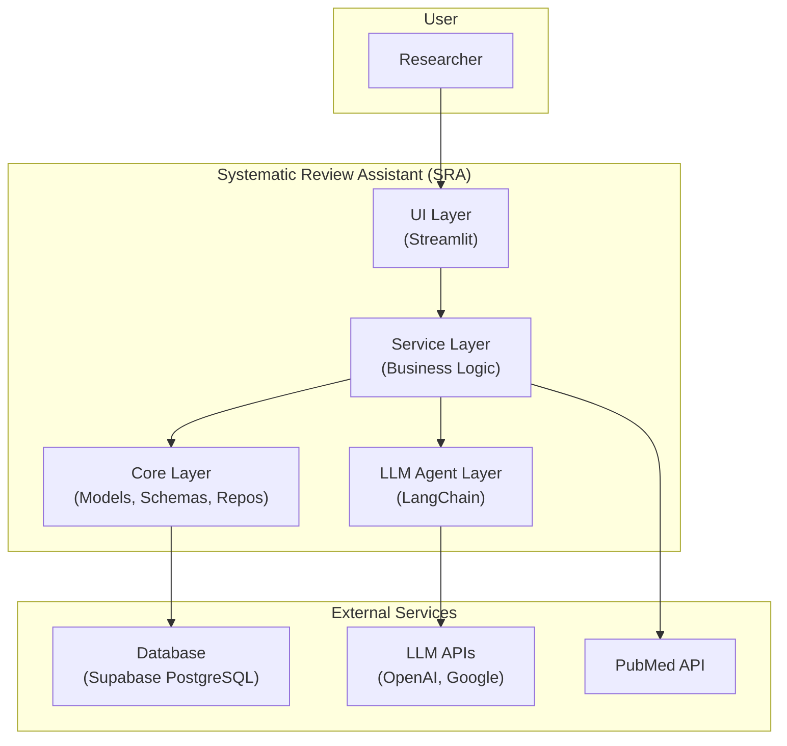

# Systematic Review Assistant Architecture Document

## Introduction

This document outlines the overall project architecture for the Systematic Review Assistant (SRA), including backend systems, shared services, and non-UI specific concerns. Its primary goal is to serve as the guiding architectural blueprint for AI-driven development, ensuring consistency and adherence to chosen patterns and technologies.

**Relationship to Frontend Architecture:**
This project has a UI, but this document is the primary architectural guide. Core technology stack choices documented herein are definitive for the entire project.

### Starter Template or Existing Project

N/A. This project is a refactoring and extension of an existing codebase.

### Change Log

| Date       | Version | Description                   | Author |
| :--------- | :------ | :---------------------------- | :----- |
| 2024-07-30 | 2.0     | Migrated to v4 template       | AIDE   |
| 2024-07-29 | 1.0     | Initial recovery architecture | AIDE   |

## High Level Architecture

### Technical Summary

The MPH Systematic Review Assistant (SRA) architecture is designed as a modular, service-oriented system built on Python. It leverages a PostgreSQL database (Supabase) for data persistence, with a clear separation between the UI (Streamlit), a business logic service layer, and a data access layer (Repositories). LLM interactions for screening and conflict resolution are managed via LangChain Expression Language (LCEL). The architecture prioritizes data integrity through strong typing (Pydantic, SQLModel) and testability by employing dependency injection and a repository pattern.

### High Level Overview

- **Architectural Style:** Service-Oriented Monolith. All code resides within a single repository but is logically separated into distinct layers (UI, Services, Core).
- **Repository Structure:** Monorepo.
- **Service Architecture:** A central service layer (`services.py`) encapsulates all business logic, orchestrating calls to repositories and external APIs.
- **Primary Data Flow:** User actions in the UI trigger service layer methods, which interact with the database via repositories and call out to LLM agents for AI-driven tasks. Data flows back to the UI for presentation.
- **Key Decisions:**
    - **Service Layer:** Centralizes business logic for reusability and clear transaction boundaries.
    - **Repository Pattern:** Decouples business logic from data persistence, enhancing testability.
    - **SQLModel/Pydantic:** Enforces strict data contracts and validation throughout the application.

### High Level Project Diagram

### Architectural and Design Patterns

- **Service Layer:** Encapsulates business logic, acting as an intermediary between UI and data layers. _Rationale:_ Promotes separation of concerns, reusability, and simplified transaction management.
- **Repository Pattern:** Abstracts data access logic for each database entity. _Rationale:_ Decouples services from data persistence specifics (SQLModel), enhancing testability and centralizing query logic.
- **Pydantic DTOs:** Pydantic schemas are used as Data Transfer Objects for validation and clear data contracts. _Rationale:_ Ensures data integrity, provides type safety, and serves as self-documentation.
- **LangChain Expression Language (LCEL):** Used for orchestrating LLM agent workflows. _Rationale:_ Provides a composable, declarative, and manageable way to define complex LLM chains.
- **Dependency Injection (Conceptual):** Dependencies (like session factories) are passed via constructors. _Rationale:_ Facilitates testability by allowing easy mocking of dependencies.

## Tech Stack

### Cloud Infrastructure

- **Provider:** Supabase (which uses AWS)
- **Key Services:** PostgreSQL, Authentication, Storage (future)
- **Deployment Regions:** As provided by Supabase.

### Technology Stack Table

| Category           | Technology         | Version       | Purpose                          | Rationale                                        |
| :----------------- | :----------------- | :------------ | :------------------------------- | :----------------------------------------------- |
| **Language**       | Python             | 3.12+         | Core application language        | Industry standard for AI/ML and web backends.    |
| **Framework**      | Streamlit          | 1.33+         | UI Framework                     | Rapid development of data-centric apps.          |
| **LLM Orchestration**| LangChain / LangGraph | ~0.3          | Building LLM-powered agents      | Composability and integration with LLM providers.|
| **Database ORM**   | SQLModel           | ~0.0.19       | Database interaction & models    | Combines Pydantic & SQLAlchemy for typed SQL.    |
| **Data Validation**| Pydantic           | ~2.5          | Data validation and settings     | Robust data validation and type enforcement.     |
| **Database**       | PostgreSQL         | 15.1          | Primary relational data store    | Provided by Supabase, robust and reliable.       |
| **API Client**     | BioPython          | 1.83+         | Accessing NCBI PubMed API        | Standard library for bioinformatics in Python.   |
| **Testing**        | Pytest             | 8.2+          | Testing framework                | Powerful, extensible testing framework.          |
| **Linting/Formatting**| Ruff            | latest        | Linter and formatter             | Fast, all-in-one tool for code quality.          |

## Data Models

*(Refer to `docs/data-models.md` for a comprehensive and detailed breakdown of all SQLModel and Pydantic schemas.)_

### Key Entities

- **SystematicReview:** Represents the core protocol for a review, including research question and inclusion/exclusion criteria.
- **SearchResult:** Stores an individual record fetched from an external database like PubMed.
- **ScreenAbstractResult:** Records the outcome of a single AI agent's screening of a `SearchResult`.
- **ScreeningResolution:** Stores the final decision after the resolver agent reconciles conflicting screening results.
- **BenchmarkRun / BenchmarkResultItem:** Models for managing and storing the results of performance benchmark evaluations.

## Components

### UI Layer (`src/sr_assistant/app/pages/`)

- **Responsibility:** User interaction, data presentation, and capturing user input.
- **Key Interfaces:** Streamlit widgets and page navigation.
- **Dependencies:** Application Service Layer.
- **Technology Stack:** Streamlit.

### Application Service Layer (`src/sr_assistant/app/services.py`)

- **Responsibility:** Encapsulates all business logic, orchestrates workflows (e.g., searching, screening), and manages database transactions.
- **Key Interfaces:** `ReviewService`, `SearchService`, `ScreeningService`.
- **Dependencies:** Core Logic Layer, LLM Agent Layer, External APIs (PubMed).
- **Technology Stack:** Python.

### Core Logic Layer (`src/sr_assistant/core/`)

- **Responsibility:** Defines the application's data structures, database access patterns, and fundamental types.
- **Key Interfaces:** `models.py` (SQLModel), `schemas.py` (Pydantic), `repositories.py` (Repository Pattern).
- **Dependencies:** Database (via SQLAlchemy engine).
- **Technology Stack:** Python, SQLModel, Pydantic, SQLAlchemy.

### LLM Agent Layer (`src/sr_assistant/app/agents/`)

- **Responsibility:** Manages all interactions with large language models, including prompt engineering, chain composition, and output parsing.
- **Key Interfaces:** `screen_abstracts_batch`, `invoke_resolver_chain`.
- **Dependencies:** LLM APIs (OpenAI, Google), Core Logic Layer (for schemas).
- **Technology Stack:** Python, LangChain, LangGraph.

### Benchmarking Sub-System (`src/sr_assistant/benchmark/`)

- **Responsibility:** A dedicated module for evaluating SRA screening performance. It includes its own UI pages, orchestration logic, and data seeding tools.
- **Key Interfaces:** UI pages for running benchmarks, logic functions for orchestration.
- **Dependencies:** Core Logic Layer, LLM Agent Layer.
- **Technology Stack:** Streamlit, Python.

## Key Workflows

### PubMed Search Workflow

1. **UI:** User submits a search query.
2. **Service Layer:** `SearchService` receives the query, calls the PubMed API via the BioPython client.
3. **Service Layer:** Results are mapped to `SearchResult` schemas.
4. **Core Layer:** `SearchResultRepository` is used to persist the new results to the database.
5. **UI:** Results are displayed to the user.

### Abstract Screening Workflow

1. **UI:** User initiates screening for a set of results.
2. **Service Layer:** `ScreeningService` orchestrates the process.
3. **LLM Agent Layer:** `screen_abstracts_batch` is called, which invokes the parallel conservative and comprehensive LLM chains.
4. **LLM Agent Layer:** If there is a conflict, the `invoke_resolver_chain` is called.
5. **Service Layer:** `ScreeningService` receives the final decisions.
6. **Core Layer:** `ScreeningResolutionRepository` is used to persist the final results.
7. **UI:** Final screening decisions are displayed.
