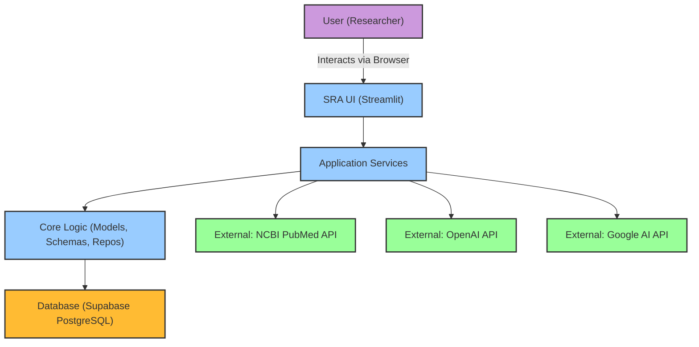
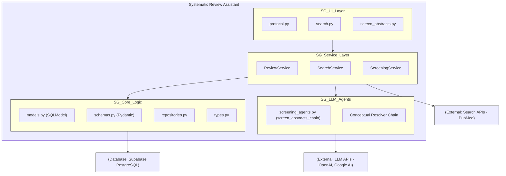
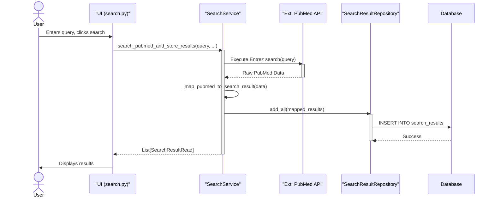
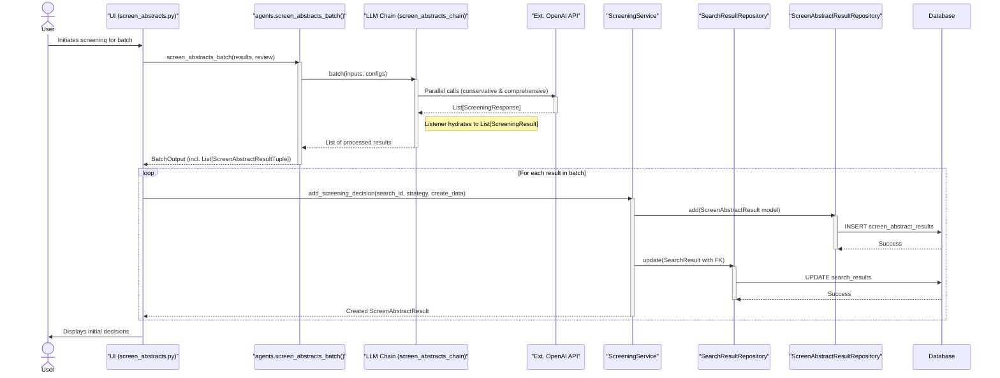
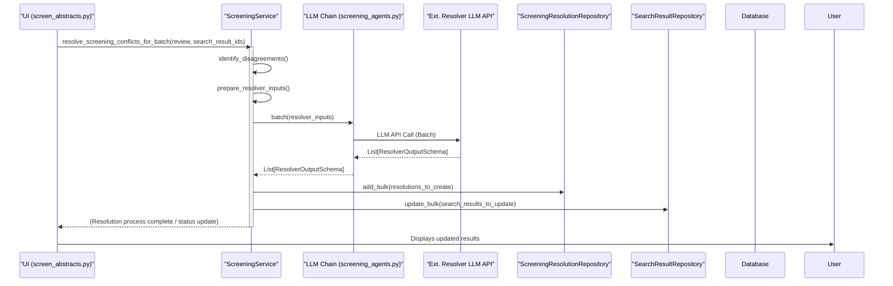

# Systematic Review Assistant - Architecture

## 1. Technical Summary

The MPH Systematic Review Assistant (SRA) is a Streamlit-based web application designed to assist researchers in conducting systematic reviews. This document outlines its technical architecture, focusing on the components and interactions necessary to achieve the goals of the recovery project: stabilizing the application, implementing a robust PubMed search, and delivering a functional automated screening conflict resolver, as detailed in [PRD for Recovery Project](prd-recovery.md).

The architecture emphasizes a modular design with a clear separation of concerns between the user interface (Streamlit pages), application services, core business logic (including data models and repositories), and interactions with external LLM APIs and databases.

## 2. Architectural Goals & Constraints

- **Modularity:** Components are designed to be loosely coupled and independently maintainable.
- **Service-Oriented:** A dedicated service layer encapsulates business logic and orchestrates data operations, providing a clear API for the UI layer.
- **Data Integrity:** Strong typing via Pydantic schemas and SQLModel, along with robust data validation and clear data flow, are prioritized.
- **Testability:** The architecture supports unit, integration, and E2E testing, with clear separation for mocking and isolated component testing.
- **Maintainability & Understandability:** Clear Naming conventions, adherence to defined coding standards ([Coding Standards Document](coding-standards.md)), and well-documented interfaces.
- **Constraint:** Utilize the existing technology stack ([Tech Stack Document](tech-stack.md)) and project structure ([Project Structure Document](project-structure.md)) as the baseline, focusing on refactoring and completing existing functionalities rather than wholesale replacement of core technologies during this recovery phase.
- **Constraint:** Session management is encapsulated within the service layer for database transactions.

### 2.3 Design Patterns & Best Practices

-   **Service Layer Pattern:** The application employs a dedicated Service Layer (`services.py`) that encapsulates business logic and orchestrates operations. This layer acts as an intermediary between the UI (Streamlit pages) and the data access/core logic layers. 
    -   *Rationale:* Promotes separation of concerns, makes business logic reusable, simplifies the UI layer, and provides a clear boundary for managing transactions and interacting with repositories.
-   **Repository Pattern:** Data access is handled by Repository classes (`repositories.py`) for each core SQLModel entity (e.g., `SearchResultRepository`, `SystematicReviewRepository`). 
    -   *Rationale:* Decouples the service layer from the specifics of data persistence (SQLModel/SQLAlchemy in this case), makes data access logic more testable (repositories can be mocked), and centralizes query logic.
-   **Pydantic for Data Transfer Objects (DTOs) & Validation:** Pydantic schemas (`schemas.py`) are extensively used for:
    -   Defining clear data contracts for service layer inputs (e.g., `SystematicReviewCreate`, `SearchResultUpdate`) and outputs (`SystematicReviewRead`, `SearchResultRead`).
    -   Validating data at the boundaries of services and before LLM interactions.
    -   Defining the structured output expected from LLM chains (e.g., `ScreeningResponse`, `ResolverOutputSchema`).
    -   *Rationale:* Enhances data integrity, provides type safety, improves developer experience with auto-completion and clear error messages, and serves as self-documentation for data structures.
-   **LangChain Expression Language (LCEL) for LLM Orchestration:** LLM interactions, particularly for the screening and resolver agents, are built using LCEL chains (`screening_agents.py`).
    -   *Rationale:* Provides a composable and declarative way to define complex LLM workflows, manage prompts, interact with models, parse outputs, and integrate features like retries and listeners (callbacks).
-   **Dependency Injection (Conceptual via Constructors):** Services and repositories are initialized with their dependencies (e.g., session factories, other repositories) primarily through their constructors.
    -   *Rationale:* Facilitates testability (dependencies can be easily mocked) and makes component dependencies explicit.
-   **Dependency Injection for Session Factory:** Services receive their `sessionmaker` instance (referred to as `session_factory`) via constructor injection. This factory defaults to the main application `session_factory` defined in `sr_assistant.app.database.py`, allowing for easy instantiation in the application while enabling tests to inject mock factories.
    -   *Rationale:* Crucial for testability of services, as it allows mocking of database session creation and interaction.
-   **Internal Session Management in Services:** Each public service method is responsible for managing the lifecycle of its database session.
    -   *Rationale:* Encapsulates transaction control within the service method that represents a single unit of work, preventing session leakage to the UI layer and simplifying calling code.
-   **Industry best practices** (e.g., PEP 8 via Ruff, conventional commits, Pydantic for validation) are followed where possible, guided by `docs/coding-standards.md`.
-   **Anti-patterns are avoided** (e.g., service layer leaking session details, direct UI to database calls).
-   **Consistent architectural style** is maintained throughout the backend components.
-   Pattern usage is documented implicitly via `docs/api-reference.md` and `docs/data-models.md`, and now more explicitly here.

## 3. System Context Diagram

## 4. Component Diagram & Descriptions

### Component Descriptions:

-   **UI Layer (Streamlit Pages - `src/sr_assistant/app/pages/`):**
    -   Responsible for user interaction and presentation.
    -   `protocol.py`: Allows users to define the systematic review protocol (research question, PICO, criteria).
    -   `search.py`: Enables users to search external databases (initially PubMed) and manage search results.
    -   `screen_abstracts.py`: Facilitates the abstract screening process, including displaying results, handling user decisions (in future iterations for manual override), and interacting with the screening/resolver backend logic.
    -   Communicates with the Application Service Layer for business logic and data operations.

-   **Application Service Layer (`src/sr_assistant/app/services.py`):**
    -   Encapsulates the core business logic of the application.
    -   Acts as an intermediary between the UI layer and the Core Logic/Data Persistence layers.
    -   `ReviewService`: Manages CRUD operations for `SystematicReview` protocols.
    -   `SearchService`: Handles searching external databases (e.g., PubMed via BioPython/Entrez), mapping results to `SearchResult` models, and storing them. Manages session lifecycle for its operations.
    -   `ScreeningService`: Orchestrates the abstract screening process. This includes managing individual screening decisions (`ScreenAbstractResult`), and invoking the conflict resolution workflow (`Resolver Chain` via `invoke_resolver_agent_batch`, storing `ScreeningResolution`). Manages session lifecycle for its operations.
    -   Services are responsible for their own database session management.

-   **Core Logic Layer (`src/sr_assistant/core/`):**
    -   `models.py`: Defines SQLModel classes representing database tables (e.g., `SystematicReview`, `SearchResult`, `ScreenAbstractResult`, `ScreeningResolution`). These are the source of truth for data structure persistence.
    -   `schemas.py`: Defines Pydantic schemas used for data validation, API request/response shaping between UI and services, and for defining structured input/output for LLM agent chains.
    -   `repositories.py`: Contains repository classes that abstract direct database interactions for each SQLModel. They are responsible for CRUD operations and are called by the Service Layer, receiving a database session from the service.
    -   `types.py`: Defines custom data types, Enums (e.g., `ScreeningDecisionType`, `SearchDatabaseSource`) used across the application.

-   **LLM Agent Layer (`src/sr_assistant/app/agents/`):**
    -   `screening_agents.py`: Contains the LangChain LCEL chains for abstract screening (`screen_abstracts_chain`) which includes parallel conservative and comprehensive reviewer logic. Defines prompts and LLM interactions for screening.
    -   `Conceptual Resolver Chain`: Represents the LangChain LCEL chain (to be fully implemented based on `prd-resolver.md`) responsible for taking outputs from the two screening reviewers and producing a final `ResolverOutputSchema`.
    -   These agents are invoked by the Service Layer (specifically `ScreeningService`).

-   **Data Persistence Layer (Supabase PostgreSQL):**
    -   The primary relational database (PostgreSQL hosted on Supabase) used for storing all application data including review protocols, search results, screening decisions, and resolutions.
    -   **Backup and Recovery:** Database backup and recovery mechanisms are provided by and managed through the Supabase platform's built-in features.

-   **External Services:**
    -   **NCBI PubMed API:** Used by `SearchService` to fetch academic literature.
    -   **OpenAI API / Google AI API:** Provide the Large Language Models (LLMs) used by the `screen_abstracts_chain` and the `resolver_chain` for decision-making and reasoning.

## 5. Key Workflows / Data Flows (High-Level)

*(This section will be brief, illustrating the main interactions. Detailed logic is in service/page plans.)*

### 5.1. PubMed Search Workflow
1.  User enters search query in `search.py` (UI).
2.  `search.py` calls `SearchService.search_pubmed_and_store_results()`.
3.  `SearchService` calls PubMed API, fetches results.
4.  `SearchService` maps raw results to `models.SearchResult` instances.
5.  `SearchService` calls `SearchResultRepository.add_all()` to store results in PostgreSQL DB.
6.  `SearchService` returns `schemas.SearchResultRead` list to `search.py`.
7.  `search.py` displays results.

#### Sequence Diagram: PubMed Search

### 5.2. Abstract Screening Workflow (Initial Dual Review)
1.  User selects search results in `search.py` and proceeds to `screen_abstracts.py`.
2.  `screen_abstracts.py` invokes `screen_abstracts_batch()` (from `screening_agents.py`) with selected `SearchResult` data and `SystematicReview` protocol.
3.  `screen_abstracts_batch()` prepares inputs and calls `screen_abstracts_chain` (LLM Agent Layer).
4.  `screen_abstracts_chain` (RunnableParallel) invokes conservative and comprehensive LLM reviewers (OpenAI API).
5.  LLMs return `schemas.ScreeningResponse` data.
6.  The `screen_abstracts_chain_on_end_cb` listener hydrates these into `schemas.ScreeningResult` objects.
7.  `screen_abstracts_batch()` returns these `ScreeningResult` objects to `screen_abstracts.py`.
8.  For each result, `screen_abstracts.py` calls `ScreeningService.add_screening_decision()` with `search_result_id`, `strategy`, and `schemas.ScreeningResultCreate` data.
9.  `ScreeningService` creates `models.ScreenAbstractResult` records and updates `SearchResult.conservative_result_id` or `comprehensive_result_id` via repositories.
10. `screen_abstracts.py` displays initial decisions.

#### Sequence Diagram: Abstract Screening (Initial Dual Review)

### 5.3. Conflict Resolution Workflow
1.  After initial screening in `screen_abstracts.py`, the page calls `ScreeningService.resolve_screening_conflicts_for_batch()` with `review` and `search_result_ids` from the batch.
2.  `ScreeningService.identify_disagreements()` fetches relevant `SearchResult` and their associated `ScreenAbstractResult` records to find conflicts.
3.  `ScreeningService.prepare_resolver_inputs()` constructs the input dictionaries for the resolver LLM chain.
4.  `ScreeningService` uses the `resolver_chain` (from `screening_agents.py`) to invoke the resolver LLM.
5.  Resolver LLM returns `schemas.ResolverOutputSchema` data.
6.  `ScreeningService` stores this resolution data using `ScreeningResolutionRepository` (creating a `ScreeningResolution` record) and updates the `SearchResult` with the `final_decision`.
7.  `screen_abstracts.py` refreshes data and displays the final resolved decisions and reasoning.

#### Sequence Diagram: Conflict Resolution

## 6. Technology Choices Overview

Refer to [Tech Stack Document](tech-stack.md) for a detailed list of technologies and versions.
Key technologies include Python, Streamlit, SQLModel, Pydantic, LangChain, PostgreSQL (Supabase), OpenAI API, Google AI API, Pytest, Ruff, `uv`.

## 7. Deployment Overview

-   **Current Phase (Recovery):** Primarily local development and testing. The application runs locally, connecting to Supabase-hosted PostgreSQL databases (prototype and test instances).
-   **Future (Post-Recovery):** Deployment to Streamlit Community Cloud is planned for broader access and user testing.
-   CI/CD is partially implemented via GitHub Actions (`.github/workflows/pr.yml`) for running tests, linting, and formatting.

## 8. Future Architectural Considerations & Evolution

While the current architecture focuses on stabilizing the existing Python/Streamlit application and implementing core functionalities (PubMed search, dual-reviewer screening, conflict resolution), it is designed with future evolution and expansion in mind, as outlined in [MPH SR Prototype Main Project Brief](MPH_SR_Prototype_Main_Project_Brief.md).

### 8.1. Technology Stack Evolution

-   **Frontend:** The long-term vision includes a transition from Streamlit to a Next.js 15 (App Router) frontend with React 19, Tailwind CSS, and Shadcn/UI (or similar modern component libraries). This will provide greater flexibility for custom UI/UX development, complex state management, and potentially better performance for a production-grade application.
-   **Backend:** A corresponding evolution to a FastAPI Python backend is planned. 
    -   The existing Python service layer (`SearchService`, `ScreeningService`, `ReviewService`) and core logic (`models.py`, `repositories.py`, `schemas.py`) are designed to be largely reusable. These Python components can be exposed via FastAPI endpoints.
    -   LangChain and LangGraph will continue to be used for LLM orchestration within this FastAPI backend.
-   **Transition Strategy (Conceptual):** The transition could be phased. Initially, the FastAPI backend could serve the Next.js frontend, while still leveraging the established Python services. Alternatively, specific functionalities could be migrated incrementally.

### 8.2. Integration of Future Modules & Capabilities

The current component-based architecture (UI -> Services -> Core Logic -> DB/External APIs) is intended to facilitate the integration of new modules:

-   **Advanced Search Module:**
    -   The `SearchService` can be extended to support Scopus and Embase by adding new internal methods for interacting with their respective APIs and new mappers (e.g., `_map_scopus_to_search_result`, `_map_embase_to_search_result`).
    -   **AI-Assisted Query Building & Validation:** The application already implements initial AI-assisted PubMed query generation in `src/sr_assistant/app/pages/search.py` using an LLM (`gpt-4o`) to draft queries based on protocol details. Future enhancements could include:
        *   More sophisticated query expansion techniques (e.g., using MeSH terms, semantic expansion).
        *   AI-driven validation of user-modified or manually entered queries against best practices for systematic review searching for PubMed, Scopus, and Embase.
        *   Interactive query refinement suggestions within the UI.
        *   These enhancements would involve updates to the UI (Streamlit, or future Next.js frontend) and potentially new methods in the `SearchService` or a dedicated `QueryRefinementService` interacting with LLMs.
-   **Embedding-Based Deduplication:**
    -   This would likely be a new service (e.g., `DeduplicationService`) that operates on `SearchResult` data. It would involve generating embeddings for abstracts/titles and implementing or using a library for similarity comparison and duplicate identification. Results could be flagged in the `SearchResult` model or managed in a separate table.
    -   **Concept:** To identify and flag duplicate or highly similar search results within a given systematic review, supplementing traditional metadata-based deduplication.
    -   **Mechanism:**
        1.  **Embedding Generation:** For each `SearchResult`, an embedding vector will be generated from its title and/or abstract using a suitable sentence transformer model (e.g., Sentence-BERT, MiniLM). These embeddings will be stored in a dedicated `embedding` column (e.g., `embedding vector(DIMENSION)`) within the `search_results` table, utilizing the `pgvector` PostgreSQL extension.
        2.  **Indexing:** An appropriate vector index (e.g., HNSW or IVFFlat provided by `pgvector`) will be created on the `embedding` column to enable efficient similarity searches.
        3.  **Similarity Search & Deduplication Logic:** When new search results are added or upon user request, for each result (or new results), its embedding will be compared against existing embeddings for the same review. Records with a cosine similarity (or other distance metric like L2) exceeding a defined threshold will be identified as potential duplicates.
        4.  **Flagging/Management:** Identified duplicates can be flagged (e.g., a boolean `is_potential_duplicate` field in `SearchResult` or linked in a separate `duplicate_sets` table).
    -   **Advantages over Traditional Deduplication:** Traditional methods rely on matching citation metadata (PMID, DOI, title, authors, journal, year, pages), which can miss semantic duplicates with variations in these fields. Embedding-based methods can identify records that are conceptually very similar even with differing metadata.
    -   **Implementation:** This would involve:
        *   Modifying the `SearchResult` SQLModel to include the `embedding` vector field.
        *   Implementing logic (potentially in `SearchService` or a new `DeduplicationService`) to generate embeddings upon result ingestion.
        *   Creating repository methods in `SearchResultRepository` for performing similarity searches using `pgvector` operators and indexes.
        *   Developing UI components to display and manage identified duplicate sets.
    -   **Future Enhancement (`pgvectorscale`):** For larger datasets and enhanced performance/features, migrating from `pgvector` to `pgvectorscale` ([https://github.com/timescale/pgvectorscale](https://github.com/timescale/pgvectorscale)) could be considered. `pgvectorscale` offers advanced indexing (like StreamingDiskANN), quantization, and efficient filtered search capabilities, potentially outperforming standard `pgvector` and other dedicated vector databases in certain scenarios.
-   **Benchmarking Module:**
    -   This will be a significant new component, potentially with its own UI views (in Streamlit initially, then Next.js) and backend services (e.g., `BenchmarkService`).
    -   It will need to read `SystematicReview`, `SearchResult`, `ScreenAbstractResult`, and `ScreeningResolution` data to calculate metrics (defined in [SR Metrics Document](sr_metrics.md)).
    -   It requires functionality to ingest external datasets (e.g., SYNERGY dataset, including its OpenAlex Work object format). This implies new data ingestion pathways and potentially new database tables or flexible storage for benchmark dataset metadata and results.
    -   The `BenchmarkService` would perform calculations and store/retrieve benchmark run configurations and results.
-   **PRISMA Flow Diagram Generation:**
    -   **Concept:** To automate the generation and dynamic updating of a PRISMA 2020 flow diagram for a systematic review, reflecting the number of records at each stage of the identification, screening, eligibility, and inclusion process.
    -   **Architectural Approach (Event-Driven with Realtime Updates):**
        1.  **Key Workflow Events:** Define and log structured events at critical points in the SR workflow that affect PRISMA counts. Examples:
            *   `SearchResultsAdded (review_id, source_db, count_added, count_duplicates_found_by_source_api)`
            *   `InternalDuplicatesIdentified (review_id, count_identified_after_internal_dedup)`
            *   `ScreeningBatchCompleted (review_id, count_screened_abstracts, count_excluded_abstracts, count_full_text_retrieval_needed)`
            *   `FullTextsScreened (review_id, count_screened_full_texts, count_excluded_full_texts, reasons_for_exclusion_counts)`
            *   `StudyIncludedInSynthesis (review_id, study_id)`
        2.  **Event Handling & Aggregation:**
            *   These events can trigger Supabase Edge Functions (or a dedicated backend service). 
            *   The function/service would consume these events and update aggregate counts for each PRISMA box for the specific `review_id`. These aggregates could be stored in `SystematicReview.review_metadata` (as a JSONB field) or a dedicated `PrismaCounts` table linked to `SystematicReview`.
        3.  **Realtime Updates & Diagram Generation:**
            *   The UI (Streamlit page or future Next.js component) responsible for displaying the PRISMA diagram would subscribe to changes in these aggregate counts via Supabase Realtime (if counts are stored in a DB table that Realtime can watch).
            *   Upon receiving updates, the UI would dynamically re-render the PRISMA diagram. This can be achieved using:
                *   A JavaScript library like Mermaid.js (for flowchart syntax) or a more specialized React/JS diagramming component.
                *   Server-side generation of an SVG or image of the diagram by an Edge Function/service, which is then fetched and displayed by the UI (less dynamic but might be simpler for complex rendering).
    -   **Advantages:** Provides a live, up-to-date PRISMA diagram that reflects the review's progress in real-time without manual counting. Improves transparency and reporting efficiency.
    -   **Implementation Notes:** Requires careful definition of all relevant events and robust aggregation logic. The choice of client-side vs. server-side rendering for the diagram depends on interactivity needs and complexity.
-   **Contextual AI Chat Assistant:**
    -   This would likely be a distinct frontend component with its own backend LangGraph agent. It would need access to application state and potentially specific service endpoints to provide contextually relevant assistance.

### 8.3. Scalability and Extensibility

-   **Service Layer:** The clear separation of services allows for independent scaling or refactoring of specific functionalities.
-   **Statelessness:** Services are designed to be stateless, relying on input parameters and database state, which is beneficial for scalability if the backend moves to a serverless or containerized environment with FastAPI.
-   **Database:** Supabase (PostgreSQL) provides a scalable database solution. Proper indexing (as already initiated) and query optimization will be important as data grows.
-   **LLM Calls:** Asynchronous operations for LLM calls (especially batching) within services will be crucial for responsiveness, particularly when the backend transitions to FastAPI which has strong async support.

### 8.4. Enhanced Transparency & Auditability Architecture

Building upon the "Architectural Goals & Constraints":

-   **Comprehensive Logging:** The service layer and LLM agent interactions should be instrumented with detailed logging (using Loguru, integrated with LogFire as per [Tech Stack Document](tech-stack.md)). Log entries should include correlation IDs (e.g., `review_id`, `search_result_id`, `run_id`) to trace operations across components.
-   **LangSmith Integration:** All LangChain/LangGraph LLM calls (screening, resolver, future AI assistance) MUST be traced using LangSmith. This is critical for debugging, monitoring LLM performance, and providing an audit trail of AI decision-making.
-   **Structured Event Logging to Database:** Consider a dedicated `audit_events` table (or similar) to log key user actions and system events with structured data (who, what, when, related entities). This complements application logs and LLM traces for a full audit picture.
    -   Example events: User creates review, user initiates search, screening batch started/completed, conflict identified, conflict resolved by AI, user manually overrides decision (future).
-   **Exportable Audit Trails:** Design data models and service methods to eventually support the export of a complete audit trail for a given systematic review, compiling information from application logs, database records, and LangSmith traces.

## 9. Document Maintenance (New Section)

This architecture document should be treated as a living document. It will be reviewed and updated:
-   After major refactoring efforts (like the current recovery project).
-   When new major features or modules (e.g., Benchmarking Module) are being designed.
-   If significant changes to the technology stack are decided.
-   Periodically, to ensure it accurately reflects the evolving system.

## Change Log

| Date       | Version | Description                                                                                                                                  | Author               |
|------------|---------|----------------------------------------------------------------------------------------------------------------------------------------------|----------------------|
| 2025-05-10 | 0.1     | Initial draft of Architecture document (as part of project recovery outputs).                                                                | wfjt/Architect Agent |
| 2025-05-11 | 0.2     | Enhanced architecture documentation; noted future Naming Conventions doc.                                                                      | wfjt/Architect Agent |
| 2025-05-13 | 0.3     | Added System Context & Component Diagrams (Mermaid), Key Workflows (text & sequence diagrams), initial Future Considerations & Maint. sections. | Architect Agent      |
| 2025-05-13 | 0.3.1   | Corrected internal document references to use Markdown link syntax.                                                                            | Architect Agent      |
| 2025-05-13 | 0.4     | Elaborated on Future Features: AI Query Building, Embedding Deduplication (incl. pgvectorscale), and event-driven PRISMA generation.         | Architect Agent      |
| 2025-05-13 | 0.5     | Clarified DB backup (Supabase). Expanded on Design Patterns (Sec 2.3). Added note on Naming Conventions doc creation.                          | Architect Agent      |
| 2025-05-13 | 0.6     | Clarified `session_factory` injection for services. (Consolidated versioning for 13th May changes).                                        | Architect Agent      | 