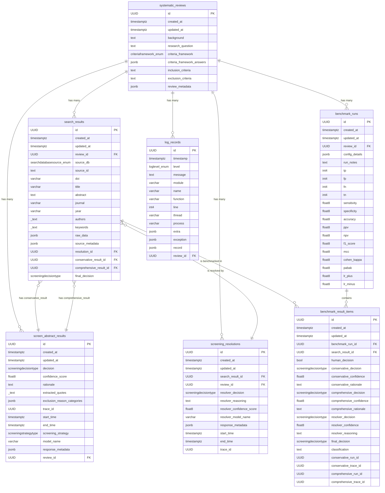

# Database Schema

This document provides a detailed overview of the database schema for the Systematic Review Assistant (SRA). The schema is designed to support the entire systematic review lifecycle, from initial search to final analysis and benchmarking.

## Entity Relationship Diagram (ERD)

The following diagram illustrates the relationships between the core tables in the database.

## Table Definitions

This section provides a detailed breakdown of each table, its columns, and their purposes.

---

### `systematic_reviews`

Stores the core information about a systematic review project.

| Column Name                  | Data Type                | Nullable | Description                                                                 |
| ---------------------------- | ------------------------ | -------- | --------------------------------------------------------------------------- |
| **id**                       | `uuid`                   | NO       | **Primary Key:** Unique identifier for the review.                          |
| `created_at`                 | `timestamptz`            | YES      | Timestamp when the record was created.                                      |
| `updated_at`                 | `timestamptz`            | YES      | Timestamp when the record was last updated.                                 |
| `background`                 | `text`                   | YES      | Background context for the systematic review.                               |
| `research_question`          | `text`                   | NO       | The primary research question.                                              |
| `criteria_framework`         | `criteriaframework_enum` | YES      | The PICO/PECO framework used for defining criteria.                         |
| `criteria_framework_answers` | `jsonb`                  | NO       | Structured answers to the chosen criteria framework.                        |
| `inclusion_criteria`         | `text`                   | YES      | A text summary of inclusion criteria (legacy, replaced by framework).       |
| `exclusion_criteria`         | `text`                   | NO       | A text summary of exclusion criteria.                                       |
| `review_metadata`            | `jsonb`                  | NO       | Any additional metadata associated with the review.                         |

---

### `search_results`

Stores individual records retrieved from academic databases like PubMed or Scopus.

| Column Name                 | Data Type                     | Nullable | Description                                                                         |
| --------------------------- | ----------------------------- | -------- | ----------------------------------------------------------------------------------- |
| **id**                      | `uuid`                        | NO       | **Primary Key:** Unique identifier for the search result record.                    |
| `created_at`                | `timestamptz`                 | YES      | Timestamp when the record was created.                                              |
| `updated_at`                | `timestamptz`                 | YES      | Timestamp when the record was last updated.                                         |
| `review_id`                 | `uuid`                        | NO       | **Foreign Key** to `systematic_reviews.id`.                                         |
| `source_db`                 | `searchdatabasesource_enum`   | NO       | The source database (e.g., 'PubMed').                                               |
| `source_id`                 | `text`                        | NO       | The unique identifier for the record within the source database (e.g., PMID).       |
| `doi`                       | `varchar`                     | YES      | Digital Object Identifier.                                                          |
| `title`                     | `varchar`                     | NO       | Article title.                                                                      |
| `abstract`                  | `text`                        | YES      | Article abstract.                                                                   |
| `journal`                   | `varchar`                     | YES      | Journal name.                                                                       |
| `year`                      | `varchar`                     | YES      | Publication year.                                                                   |
| `authors`                   | `_text` (array of text)       | YES      | List of authors.                                                                    |
| `keywords`                  | `_text` (array of text)       | YES      | List of keywords.                                                                   |
| `raw_data`                  | `jsonb`                       | NO       | The original raw record from the source API.                                        |
| `source_metadata`           | `jsonb`                       | NO       | Additional source-specific metadata.                                                |
| `resolution_id`             | `uuid`                        | YES      | **Foreign Key** to `screening_resolutions.id` if a conflict was resolved.           |
| `conservative_result_id`    | `uuid`                        | YES      | **Foreign Key** to `screen_abstract_results.id` for the conservative screening.     |
| `comprehensive_result_id`   | `uuid`                        | YES      | **Foreign Key** to `screen_abstract_results.id` for the comprehensive screening.    |
| `final_decision`            | `screeningdecisiontype`       | YES      | The final decision after all screening and resolution steps.                        |

---

### `screen_abstract_results`

Stores the output of an LLM screening agent (either conservative or comprehensive) for a single abstract.

| Column Name                       | Data Type                 | Nullable | Description                                                                    |
| --------------------------------- | ------------------------- | -------- | ------------------------------------------------------------------------------ |
| **id**                            | `uuid`                    | NO       | **Primary Key:** Unique identifier, typically the LangSmith run ID.            |
| `created_at`                      | `timestamptz`             | YES      | Timestamp when the record was created.                                         |
| `updated_at`                      | `timestamptz`             | YES      | Timestamp when the record was last updated.                                    |
| `decision`                        | `screeningdecisiontype`   | NO       | The screening decision (Include, Exclude, Uncertain).                          |
| `confidence_score`                | `float8`                  | NO       | The LLM's confidence in its decision (0.0 to 1.0).                             |
| `rationale`                       | `text`                    | NO       | The LLM's reasoning for its decision.                                          |
| `extracted_quotes`                | `_text` (array of text)   | YES      | Supporting quotes from the abstract.                                           |
| `exclusion_reason_categories`     | `jsonb`                   | NO       | Structured reasons for exclusion.                                              |
| `trace_id`                        | `uuid`                    | YES      | The LangSmith trace ID for the full screening run.                             |
| `start_time`                      | `timestamptz`             | YES      | When the LLM invocation started.                                               |
| `end_time`                        | `timestamptz`             | YES      | When the LLM invocation ended.                                                 |
| `screening_strategy`              | `screeningstrategytype`   | NO       | The strategy used ('conservative' or 'comprehensive').                         |
| `model_name`                      | `varchar`                 | NO       | The name of the LLM used.                                                      |
| `response_metadata`               | `jsonb`                   | NO       | Metadata from the LLM response (e.g., token usage).                            |
| `review_id`                       | `uuid`                    | NO       | **Foreign Key** to `systematic_reviews.id`.                                    |

---

### `screening_resolutions`

Stores the output of the resolver agent, which makes a final decision when the conservative and comprehensive agents disagree.

| Column Name                   | Data Type               | Nullable | Description                                                                  |
| ----------------------------- | ----------------------- | -------- | ---------------------------------------------------------------------------- |
| **id**                        | `uuid`                  | NO       | **Primary Key:** Unique identifier for the resolution record.                |
| `created_at`                  | `timestamptz`           | YES      | Timestamp when the record was created.                                       |
| `updated_at`                  | `timestamptz`           | YES      | Timestamp when the record was last updated.                                  |
| `search_result_id`            | `uuid`                  | NO       | **Foreign Key** to the `search_results.id` that was resolved.                |
| `review_id`                   | `uuid`                  | NO       | **Foreign Key** to `systematic_reviews.id`.                                  |
| `resolver_decision`           | `screeningdecisiontype` | NO       | The final decision from the resolver agent.                                  |
| `resolver_reasoning`          | `text`                  | NO       | The resolver's reasoning.                                                    |
| `resolver_confidence_score`   | `float8`                | NO       | The resolver's confidence in its decision.                                   |
| `resolver_model_name`         | `varchar`               | YES      | The name of the resolver LLM used.                                           |
| `response_metadata`           | `jsonb`                 | NO       | Metadata from the resolver LLM response.                                     |
| `start_time`                  | `timestamptz`           | YES      | When the resolver invocation started.                                        |
| `end_time`                    | `timestamptz`           | YES      | When the resolver invocation ended.                                          |
| `trace_id`                    | `uuid`                  | YES      | The LangSmith trace ID for the resolver run.                                 |

---

### `benchmark_runs`

Stores the configuration and high-level summary results for a single benchmark execution.

| Column Name      | Data Type     | Nullable | Description                                                              |
| ---------------- | ------------- | -------- | ------------------------------------------------------------------------ |
| **id**           | `uuid`        | NO       | **Primary Key:** Unique identifier for the benchmark run.                |
| `created_at`     | `timestamptz` | YES      | Timestamp when the record was created.                                   |
| `updated_at`     | `timestamptz` | YES      | Timestamp when the record was last updated.                              |
| `review_id`      | `uuid`        | NO       | **Foreign Key** to the `systematic_reviews.id` (protocol) used.          |
| `config_details` | `jsonb`       | YES      | Configuration settings for the run (e.g., LLM models, prompt versions).  |
| `run_notes`      | `text`        | YES      | User-provided notes about the run.                                       |
| `tp`             | `int4`        | YES      | True Positives.                                                          |
| `fp`             | `int4`        | YES      | False Positives.                                                         |
| `fn`             | `int4`        | YES      | False Negatives.                                                         |
| `tn`             | `int4`        | YES      | True Negatives.                                                          |
| `sensitivity`    | `float8`      | YES      | Sensitivity (Recall).                                                    |
| `specificity`    | `float8`      | YES      | Specificity.                                                             |
| `accuracy`       | `float8`      | YES      | Accuracy.                                                                |
| `ppv`            | `float8`      | YES      | Positive Predictive Value (Precision).                                   |
| `npv`            | `float8`      | YES      | Negative Predictive Value.                                               |
| `f1_score`       | `float8`      | YES      | F1 Score.                                                                |
| `mcc`            | `float8`      | YES      | Matthews Correlation Coefficient.                                        |
| `cohen_kappa`    | `float8`      | YES      | Cohen's Kappa.                                                           |
| `pabak`          | `float8`      | YES      | Prevalence and Bias Adjusted Kappa.                                      |
| `lr_plus`        | `float8`      | YES      | Positive Likelihood Ratio.                                               |
| `lr_minus`       | `float8`      | YES      | Negative Likelihood Ratio.                                               |

---

### `benchmark_result_items`

Stores the detailed outcome for a single item within a benchmark run, comparing the SRA's decisions to the human ground truth.

| Column Name                 | Data Type               | Nullable | Description                                                                |
| --------------------------- | ----------------------- | -------- | -------------------------------------------------------------------------- |
| **id**                      | `uuid`                  | NO       | **Primary Key:** Unique identifier for the result item.                    |
| `benchmark_run_id`          | `uuid`                  | NO       | **Foreign Key** to `benchmark_runs.id`.                                    |
| `search_result_id`          | `uuid`                  | NO       | **Foreign Key** to `search_results.id`.                                    |
| `human_decision`            | `bool`                  | YES      | Ground truth decision (True for include, False for exclude).               |
| `conservative_decision`     | `screeningdecisiontype` | YES      | Decision from the conservative agent.                                      |
| `comprehensive_decision`    | `screeningdecisiontype` | YES      | Decision from the comprehensive agent.                                     |
| `resolver_decision`         | `screeningdecisiontype` | YES      | Decision from the resolver agent, if invoked.                              |
| `final_decision`            | `screeningdecisiontype` | NO       | The final decision made by the SRA pipeline.                               |
| `classification`            | `text`                  | NO       | Classification against ground truth ('TP', 'FP', 'TN', 'FN').              |
| ... other fields ...        | ...                     | YES      | Confidence scores, rationales, and run IDs for each agent decision.        |

---

### `log_records`

Stores application log records for debugging and monitoring.

| Column Name | Data Type       | Nullable | Description                                         |
| ----------- | --------------- | -------- | --------------------------------------------------- |
| **id**      | `uuid`          | NO       | **Primary Key:** Unique identifier for the log.     |
| `timestamp` | `timestamptz`   | NO       | The UTC timestamp of the log event.                 |
| `level`     | `loglevel_enum` | NO       | The log level (e.g., 'INFO', 'ERROR').              |
| `message`   | `text`          | NO       | The log message.                                    |
| `module`    | `varchar`       | YES      | The Python module where the log originated.         |
| `name`      | `varchar`       | YES      | The logger name.                                    |
| `function`  | `varchar`       | YES      | The function where the log originated.              |
| `line`      | `int4`          | YES      | The line number where the log originated.           |
| `extra`     | `jsonb`         | NO       | Additional structured context.                      |
| `exception` | `jsonb`         | YES      | Structured exception information, if any.           |
| `record`    | `jsonb`         | NO       | The full, raw log record from the logging library.  |
| `review_id` | `uuid`          | YES      | **Foreign Key** to `systematic_reviews.id`, if applicable. |

</rewritten_file>
