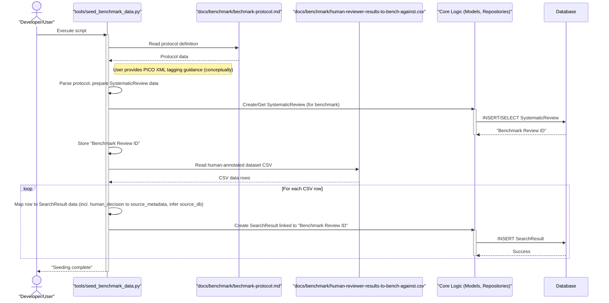
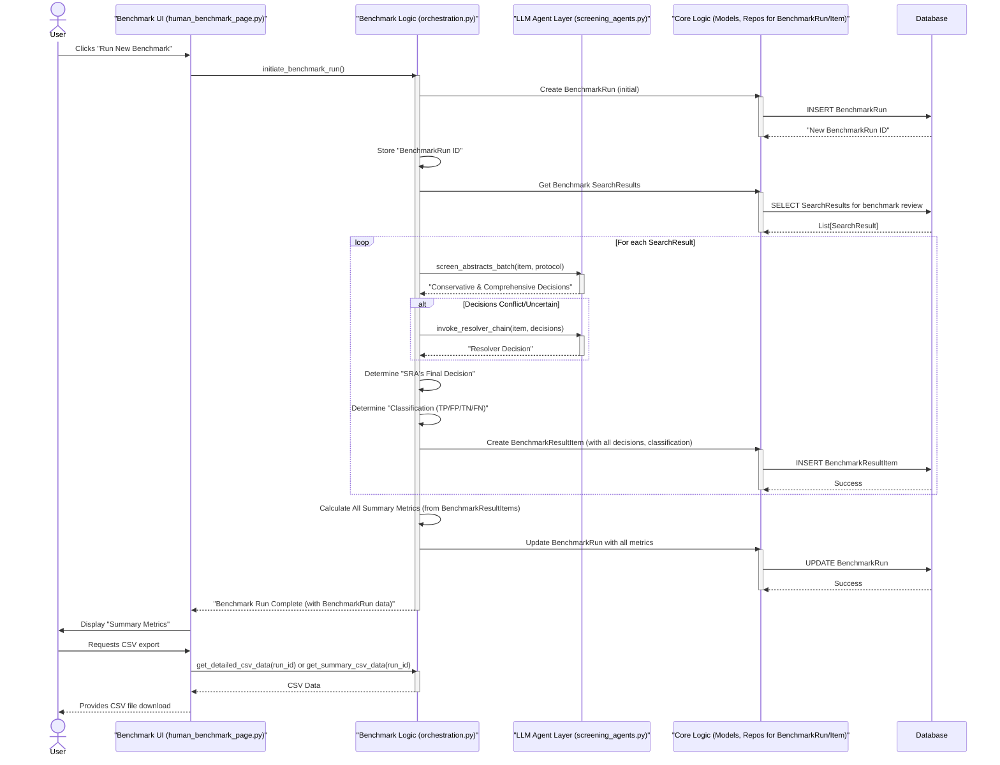

# Benchmark Sub-System Workflows

This document contains the Mermaid sequence diagrams for the SRA Benchmarking Sub-System.

## Workflow 1: Benchmark Data Seeding

## Workflow 2: Benchmark Execution & Metrics Calculation

