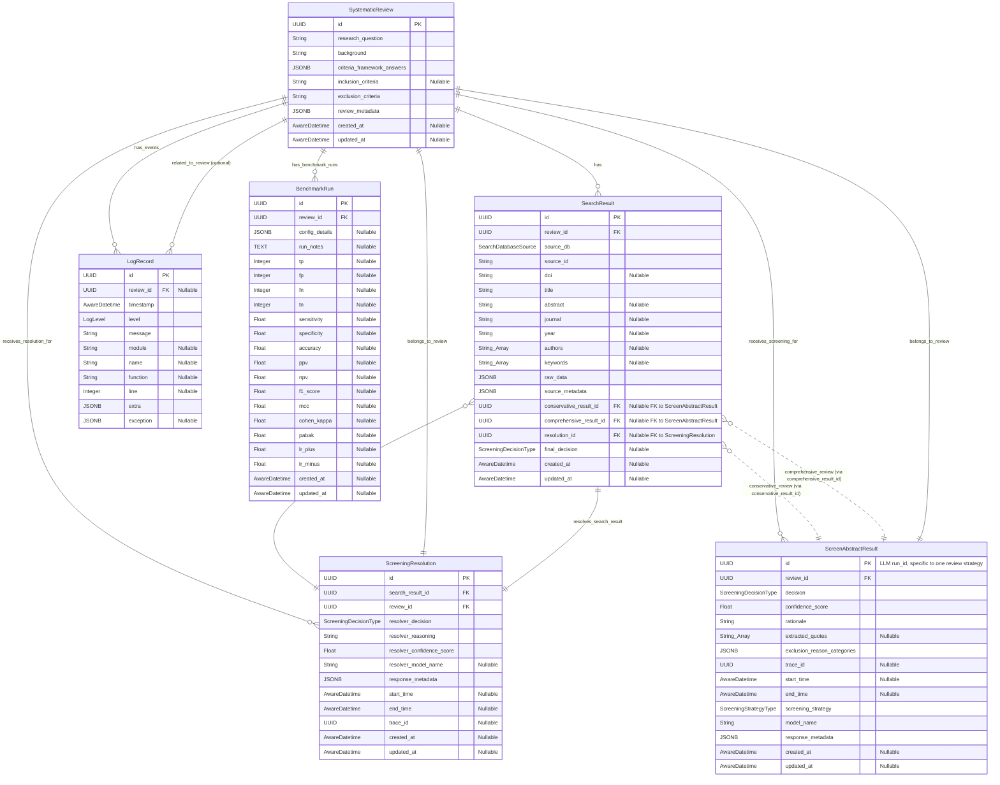

# Data Models and Schemas

This document details the key SQLModel database models and Pydantic schemas used for data validation, API operations, and LLM interactions within the Systematic Review Assistant application.

## Table of Contents

- [Guiding Principles](#guiding-principles)
- [SQLModel Database Models (Overview)](#sqlmodel-database-models-overview)
- [Pydantic Schemas for API Operations and LLM Interactions](#pydantic-schemas-for-api-operations-and-llm-interactions)
    - [Systematic Review Schemas](#systematic-review-schemas)
    - [Search Result Schemas](#search-result-schemas)
    - [Screening Schemas (LLM and Service Layer)](#screening-schemas-llm-and-service-layer)
    - [Benchmark Schemas](#benchmark-schemas)
    - [Suggestion Agent Schemas](#suggestion-agent-schemas)
- [Notes on Existing `src/sr_assistant/core/schemas.py`](#notes-on-existing-srcsr_assistantcoreschemaspy)

## Guiding Principles

- **Clarity and Purpose:** Each schema should have a clear purpose (e.g., creating a resource, updating a resource, reading a resource, LLM input/output).
- **Validation:** Schemas provide a layer of data validation before data enters the service layer or is sent to LLMs.
- **API Contract:** `Create`, `Update`, and `Read` schemas form a critical part of the API contract defined in `docs/api-reference.md`.
- **Immutability for LLM I/O:** Schemas representing direct LLM input or output should be treated as immutable contracts where possible.
- **Inheritance:** All Pydantic schemas defined for this project **MUST** inherit from `core.schemas.BaseSchema` to ensure consistent `model_config` application (e.g., `populate_by_name`, `validate_assignment`, `use_attribute_docstrings`).

#### Pydantic Field Documentation Standard

- **Field Docstrings are Mandatory:** All fields within Pydantic models **MUST** be documented using a field-specific docstring written directly beneath the field definition.
  ```python
  from sr_assistant.core.schemas import BaseSchema
  
  class MySchema(BaseSchema):
      my_field: str
      """This is the official documentation for my_field. It will be shown by IDEs and in JSONSchema."""
  ```
- **AVOID `Field(description=...)`:** The `description` parameter within `pydantic.Field()` **MUST NOT** be used for primary field documentation. While this `description` is included in the JSON schema (useful for OpenAPI docs), it is **NOT** visible in IDE tooltips or via Language Server Protocol (LSP) introspection when working with the Python code. Field docstrings are visible and are the standard for this project.
- **Rationale:** This standard ensures that documentation is accessible to developers directly within their IDEs, improving code comprehensibility and maintainability. The `BaseSchema.model_config` is set with `use_attribute_docstrings=True` to automatically populate the JSON schema `description` from these field docstrings, providing the best of both worlds.

## SQLModel Database Models (Overview)

The source of truth for database table structures is defined using SQLModel in `src/sr_assistant/core/models.py`. Key models include:

- `SystematicReview`: Stores review protocols, research questions, and criteria.
- `SearchResult`: Stores individual records retrieved from academic databases.
- `ScreenAbstractResult`: Stores the outcome of an LLM screening decision (conservative or comprehensive) for a `SearchResult`.
- `ScreeningResolution`: Stores the outcome of the conflict resolution process for a `SearchResult`.
- `LogRecord`: For application logging (details not covered in this document).
- `BenchmarkRun`: Stores the configuration and summary results of a benchmark execution.

Below is an Entity Relationship Diagram illustrating the primary relationships between these core models.



This document will focus on the Pydantic schemas used for interacting with these models via the service layer and with LLMs.

## Pydantic Schemas for API Operations and LLM Interactions

These schemas are, or should be, defined in `src/sr_assistant/core/schemas.py`.

### Systematic Review Schemas

These schemas are used for creating, reading, and updating `SystematicReview` entities. All schemas inherit from `core.schemas.BaseSchema`.

#### `SystematicReviewCreate`

Used by `ReviewService.create_review` for creating new systematic review protocols.

```python
import uuid
from collections.abc import MutableMapping

from pydantic import Field, JsonValue

from sr_assistant.core.schemas import BaseSchema # Assuming BaseSchema is in this path
from sr_assistant.core.types import CriteriaFramework, AwareDatetime # Assuming types are here

class SystematicReviewCreate(BaseSchema):
    background: str | None = None
    """Optional background context for the systematic review."""

    research_question: str
    """The primary research question the systematic review aims to answer. This field is mandatory."""

    criteria_framework: CriteriaFramework | None = None
    """The specific criteria framework being used (e.g., PICO, SPIDER)."""

    criteria_framework_answers: MutableMapping[str, JsonValue] = Field(default_factory=dict)
    """A dictionary holding the answers/components for the chosen criteria_framework (e.g., keys like 'population', 'intervention' for PICO)."""

    inclusion_criteria: str | None = None
    """A string representation of inclusion criteria. 
    IMPORTANT NOTE: Currently, the screening LLM chain uses this field. The `protocol.py` page combines structured `criteria_framework_answers` into this string. This is a known area for future refactoring.
    """

    exclusion_criteria: str
    """A string representation of explicit exclusion criteria. This field is mandatory."""

    review_metadata: MutableMapping[str, JsonValue] = Field(default_factory=dict)
    """Any additional metadata associated with the review, stored as a JSON object."""
```

#### `SystematicReviewUpdate`

Used by `ReviewService.update_review` for partially updating an existing systematic review protocol. All fields are optional.

```python
import uuid
from collections.abc import MutableMapping

from pydantic import Field, JsonValue, AwareDatetime

from sr_assistant.core.schemas import BaseSchema
from sr_assistant.core.types import CriteriaFramework

class SystematicReviewUpdate(BaseSchema):
    background: str | None = None
    """Optional background context for the systematic review."""

    research_question: str | None = None
    """The primary research question the systematic review aims to answer."""

    criteria_framework: CriteriaFramework | None = None
    """The specific criteria framework being used (e.g., PICO, SPIDER)."""

    criteria_framework_answers: MutableMapping[str, JsonValue] | None = None
    """A dictionary holding the answers/components for the chosen criteria_framework."""

    inclusion_criteria: str | None = None
    """A string representation of inclusion criteria."""

    exclusion_criteria: str | None = None
    """A string representation of explicit exclusion criteria."""

    review_metadata: MutableMapping[str, JsonValue] | None = None
    """Any additional metadata associated with the review, stored as a JSON object."""
```

**Note on `schemas.py`:** The `SystematicReviewUpdate` in `schemas.py` correctly makes all fields optional for partial updates by redefining them with `| None = Field(default=None, ...)` within its own definition, inheriting from `SystematicReviewBase` but ensuring optionality.

#### `SystematicReviewRead`

Schema for returning `SystematicReview` data from the service layer, including database-generated fields.

```python
import uuid
from collections.abc import MutableMapping

from pydantic import Field, JsonValue, AwareDatetime

from sr_assistant.core.schemas import BaseSchema
from sr_assistant.core.types import CriteriaFramework

class SystematicReviewRead(BaseSchema):
    id: uuid.UUID
    """The unique identifier of the systematic review."""

    created_at: AwareDatetime | None = None
    """Timestamp of when the review was created in the database (UTC). Must be timezone-aware."""

    updated_at: AwareDatetime | None = None
    """Timestamp of when the review was last updated in the database (UTC). Must be timezone-aware."""

    background: str | None
    """Background context for the systematic review."""

    research_question: str
    """The primary research question the systematic review aims to answer."""

    criteria_framework: CriteriaFramework | None
    """The specific criteria framework being used (e.g., PICO, SPIDER)."""

    criteria_framework_answers: MutableMapping[str, JsonValue]
    """A dictionary holding the answers/components for the chosen criteria_framework."""

    inclusion_criteria: str | None
    """A string representation of inclusion criteria. 
    IMPORTANT NOTE: (See note in SystematicReviewCreate and API Reference)
    """

    exclusion_criteria: str
    """A string representation of explicit exclusion criteria."""

    review_metadata: MutableMapping[str, JsonValue]
    """Any additional metadata associated with the review, stored as a JSON object."""
```

*(The `SystematicReviewRead` schema in the current `schemas.py` generally aligns with this, but ensure `created_at` and `updated_at` are correctly typed, ideally as `AwareDatetime` from Pydantic or a custom `UtcDatetime` type if defined.)*

### Search Result Schemas

These schemas are primarily for reading and updating `SearchResult` entities. Creation is handled internally by `SearchService` after fetching from external APIs. All schemas inherit from `core.schemas.BaseSchema`.

#### `SearchResultRead`

Schema for returning `SearchResult` data from the service layer.

```python
import uuid
import collections.abc # For Mapping
from pydantic import JsonValue, AwareDatetime

from sr_assistant.core.schemas import BaseSchema
from sr_assistant.core.types import SearchDatabaseSource, ScreeningDecisionType

# Conceptual: Forward references might be needed if these Read schemas are also defined here
# from typing import TYPE_CHECKING
# if TYPE_CHECKING:
#     from .screening_schemas import ScreeningResultRead, ScreeningResolutionRead # Example if they were in a different module

class SearchResultRead(BaseSchema):
    id: uuid.UUID
    """Unique identifier for the search result."""

    review_id: uuid.UUID
    """Identifier of the systematic review this search result belongs to."""

    source_db: SearchDatabaseSource
    """The source database from which this result was obtained (e.g., PubMed, Scopus)."""

    source_id: str
    """The unique identifier of this record within its source database (e.g., PMID)."""

    doi: str | None
    """Digital Object Identifier, if available."""

    title: str
    """The title of the publication."""

    abstract: str | None
    """The abstract of the publication."""

    journal: str | None
    """The name of the journal in which the publication appeared."""

    year: str | None # Aligning with models.py SearchResult.year which is str | None
    """The publication year (as a string)."""

    authors: list[str] | None
    """A list of author names."""

    keywords: list[str] | None
    """A list of keywords associated with the publication."""

    raw_data: collections.abc.Mapping[str, JsonValue]
    """The original raw data record fetched from the source API."""

    source_metadata: collections.abc.Mapping[str, JsonValue]
    """Additional source-specific metadata."""

    created_at: AwareDatetime | None
    """Timestamp of when this search result was first stored (UTC). Must be timezone-aware."""

    updated_at: AwareDatetime | None
    """Timestamp of when this search result was last updated (UTC). Must be timezone-aware."""

    # Fields related to screening and resolution
    final_decision: ScreeningDecisionType | None = None
    """The final screening decision after any conflict resolution. Null if not yet resolved or no conflict."""

    resolution_id: uuid.UUID | None = None
    """Identifier of the ScreeningResolution record, if a conflict was resolved for this search result."""

    # Optional related objects (conceptual, actual loading depends on service/repo query)
    # conservative_result: "ScreeningResultRead" | None = None # Example for self-referential/forward Pydantic models
    # comprehensive_result: "ScreeningResultRead" | None = None
    # resolution: "ScreeningResolutionRead" | None = None
```

**Note on `schemas.py`:** The `SearchResultRead` in `schemas.py` correctly defines `year` as `str | None`. It uses `MutableMapping[str, JsonValue]` (from `collections.abc`) for `raw_data` and `source_metadata`. Key fields like `final_decision` and `resolution_id` are present in the schema definition in `schemas.py`.

#### `SearchResultUpdate`

Used by `SearchService.update_search_result` for partially updating an existing search result. All fields are optional.

```python
import uuid
import collections.abc # For Mapping
from pydantic import JsonValue

from sr_assistant.core.schemas import BaseSchema
from sr_assistant.core.types import ScreeningDecisionType

class SearchResultUpdate(BaseSchema):
    doi: str | None = None
    """Digital Object Identifier."""

    title: str | None = None
    """The title of the publication."""

    abstract: str | None = None
    """The abstract of the publication."""

    journal: str | None = None
    """The name of the journal."""

    year: str | None = None
    """The publication year (as a string)."""

    authors: list[str] | None = None
    """A list of author names."""

    keywords: list[str] | None = None
    """A list of keywords."""

    raw_data: collections.abc.Mapping[str, JsonValue] | None = None
    """The original raw data record."""

    source_metadata: collections.abc.Mapping[str, JsonValue] | None = None
    """Additional source-specific metadata."""

    # Fields related to screening and resolution that might be updated via SearchService
    final_decision: ScreeningDecisionType | None = None
    """The final screening decision after any conflict resolution."""

    resolution_id: uuid.UUID | None = None
    """Identifier of the ScreeningResolution record."""
```

**Note on `schemas.py`:** The `SearchResultUpdate` schema is defined in `schemas.py` and aligns with the structure presented here, allowing partial updates to `SearchResult` records.

### Screening Schemas (LLM and Service Layer)

These schemas define the data structures for LLM outputs related to screening, and for creating, reading, and updating `ScreenAbstractResult` and `ScreeningResolution` entities via the `ScreeningService`. All Pydantic schemas inherit from `core.schemas.BaseSchema`.

#### `ScreeningResponse` (LLM Output for Individual Reviewers)

This schema defines the structured output expected from the individual screening LLM chains (conservative and comprehensive). It is defined in `src/sr_assistant/core/schemas.py`.

```python
from pydantic import Field, JsonValue

from sr_assistant.core.schemas import BaseSchema, ExclusionReasons # Assuming ExclusionReasons is defined
from sr_assistant.core.types import ScreeningDecisionType

class ScreeningResponse(BaseSchema):
    decision: ScreeningDecisionType
    """The screening decision (INCLUDE, EXCLUDE, UNCERTAIN). If confidence is < 0.8, should be UNCERTAIN."""

    confidence_score: float = Field(ge=0.0, le=1.0) # Pydantic v1 ge/le, v2 use GtE/LtE validators
    """The confidence score [0.0, 1.0] for the decision. If < 0.8, decision must be UNCERTAIN."""

    rationale: str
    """Specific rationale for the decision, explaining how abstract content relates to criteria."""

    extracted_quotes: list[str] | None = None
    """Supporting quotes from the title/abstract. Optional, can be omitted if uncertain."""

    exclusion_reason_categories: ExclusionReasons | None = None
    """PRISMA exclusion reason categories. Must be set if decision is EXCLUDE. Omit if INCLUDE."""
```

#### `ScreeningResult` (Hydrated LLM Output + Metadata)

This schema represents a `ScreeningResponse` that has been processed and hydrated with additional context (like IDs, timestamps) by the `screen_abstracts_chain_on_end_cb` listener. It is defined in `src/sr_assistant/core/schemas.py`.

```python
import uuid
from pydantic import Field, JsonValue, AwareDatetime

from sr_assistant.core.schemas import BaseSchema, ScreeningResponse # Assumes ScreeningResponse is as above
from sr_assistant.core.types import ScreeningStrategyType

class ScreeningResult(ScreeningResponse):
    id: uuid.UUID
    """Screening result ID, typically the LangSmith Run ID of the specific reviewer invocation."""

    review_id: uuid.UUID
    """ID of the SystematicReview this screening pertains to."""

    search_result_id: uuid.UUID
    """ID of the SearchResult being screened."""

    trace_id: uuid.UUID
    """LangSmith trace_id, shared between reviewers for the same SearchResult input."""

    model_name: str
    """Name of the LLM used for this screening decision."""

    screening_strategy: ScreeningStrategyType
    """The strategy used (e.g., CONSERVATIVE, COMPREHENSIVE)."""

    start_time: AwareDatetime
    """UTC timestamp when the LLM chain invocation started."""

    end_time: AwareDatetime
    """UTC timestamp when the LLM chain invocation ended."""

    response_metadata: dict[str, JsonValue] = Field(default_factory=dict)
    """Additional metadata from the LLM invocation (inputs, token usage, etc.)."""
```

#### `ScreeningResultCreate` (Service Input for Storing Screening)

Used by `ScreeningService.add_screening_decision` to create a `ScreenAbstractResult` database record. This schema takes all necessary fields from a `ScreeningResult` (which is an enriched `ScreeningResponse`).

```python
import uuid
from pydantic import Field, JsonValue, AwareDatetime

from sr_assistant.core.schemas import BaseSchema, ExclusionReasons
from sr_assistant.core.types import ScreeningDecisionType, ScreeningStrategyType

class ScreeningResultCreate(BaseSchema):
    # Fields from ScreeningResponse / ScreeningResult that are directly stored
    decision: ScreeningDecisionType
    """The screening decision (INCLUDE, EXCLUDE, UNCERTAIN)."""

    confidence_score: float = Field(ge=0.0, le=1.0)
    """The confidence score [0.0, 1.0] for the decision."""

    rationale: str
    """Specific rationale for the decision."""

    extracted_quotes: list[str] | None = None
    """Supporting quotes from the title/abstract."""

    exclusion_reason_categories: ExclusionReasons | None = None # Or dict[str, list[str]] if ExclusionReasons model is complex
    """PRISMA exclusion reason categories as a structured object or dict."""

    # Fields from ScreeningResult (contextual/metadata)
    id: uuid.UUID # This is the LLM run_id, used as PK for ScreenAbstractResult model
    """Screening result ID, from the LangSmith Run ID of the reviewer invocation."""

    review_id: uuid.UUID
    """ID of the SystematicReview this screening pertains to."""

    # search_result_id is implicitly linked when ScreenAbstractResult is created/associated
    # It's not directly part of ScreenAbstractResult model but crucial for relating.
    # The service method add_screening_decision would need search_result_id to link it.
    # However, the ScreenAbstractResult model itself does not have search_result_id.
    # This indicates a potential modeling issue or a need to pass search_result_id separately to the service.
    # For now, assuming the ScreenAbstractResult model will be updated or service handles linking.
    # Let's assume ScreenAbstractResult SQLModel will have a search_result_id FK.

    trace_id: uuid.UUID | None = None # Nullable, as per model
    """LangSmith trace_id, shared between reviewers for the same SearchResult input."""

    model_name: str
    """Name of the LLM used for this screening decision."""

    screening_strategy: ScreeningStrategyType
    """The strategy used (e.g., CONSERVATIVE, COMPREHENSIVE)."""

    start_time: AwareDatetime | None = None # Nullable, as per model
    """UTC timestamp when the LLM chain invocation started. Must be timezone-aware if not None."""

    end_time: AwareDatetime | None = None # Nullable, as per model
    """UTC timestamp when the LLM chain invocation ended. Must be timezone-aware if not None."""

    response_metadata: dict[str, JsonValue] = Field(default_factory=dict)
    """Additional metadata from the LLM invocation (inputs, token usage, etc.)."""
```
**Note on linking `ScreenAbstractResult` to `SearchResult`:**
The `models.SearchResult` (defined in `src/sr_assistant/core/models.py`) already contains `conservative_result_id` and `comprehensive_result_id`. These fields are foreign keys to `ScreenAbstractResult.id`.
This means a `ScreenAbstractResult` record is created first (using data from this `ScreeningResultCreate` schema).
The `ScreeningService.add_screening_decision` method (defined in `docs/api-reference.md`) is then responsible for:

   1. Taking `search_result_id` and `screening_strategy` as parameters (alongside `ScreeningResultCreate` data).
   2. Creating the `ScreenAbstractResult` record.
   3. Updating the corresponding `SearchResult` record's `conservative_result_id` or `comprehensive_result_id` field with the ID of the newly created `ScreenAbstractResult`.
This `ScreeningResultCreate` schema itself does not need to contain `search_result_id` as that context is passed directly to the service method.

#### `ScreeningResultUpdate` (Service Input)

Used by `ScreeningService.update_screening_decision`. All fields are optional.

```python
import uuid
from pydantic import Field, JsonValue, AwareDatetime

from sr_assistant.core.schemas import BaseSchema, ExclusionReasons
from sr_assistant.core.types import ScreeningDecisionType, ScreeningStrategyType

class ScreeningResultUpdate(BaseSchema):
    decision: ScreeningDecisionType | None = None
    """The screening decision."""

    confidence_score: float | None = Field(default=None, ge=0.0, le=1.0)
    """The confidence score."""

    rationale: str | None = None
    """Specific rationale."""

    extracted_quotes: list[str] | None = None
    """Supporting quotes."""

    exclusion_reason_categories: ExclusionReasons | None = None
    """PRISMA exclusion categories."""

    trace_id: uuid.UUID | None = None
    """LangSmith trace_id."""

    model_name: str | None = None
    """Name of the LLM."""

    screening_strategy: ScreeningStrategyType | None = None
    """The strategy used."""

    start_time: AwareDatetime | None = None
    """Invocation start time. Must be timezone-aware if not None."""

    end_time: AwareDatetime | None = None
    """Invocation end time. Must be timezone-aware if not None."""

    response_metadata: dict[str, JsonValue] | None = None
    """Additional LLM metadata."""
```

#### `ScreeningResultRead` (Service Output)

Schema for returning `ScreenAbstractResult` data from the service layer.

```python
import uuid
from pydantic import Field, JsonValue, AwareDatetime

from sr_assistant.core.schemas import BaseSchema, ExclusionReasons
from sr_assistant.core.types import ScreeningDecisionType, ScreeningStrategyType

class ScreeningResultRead(BaseSchema):
    id: uuid.UUID
    """Unique ID of this screening record (typically the LLM run_id)."""

    created_at: AwareDatetime | None
    """Timestamp of when this record was created in the database (UTC). Must be timezone-aware."""

    updated_at: AwareDatetime | None
    """Timestamp of when this record was last updated (UTC). Must be timezone-aware."""

    decision: ScreeningDecisionType
    """The screening decision."""

    confidence_score: float
    """The confidence score."""

    rationale: str
    """Rationale for the decision."""

    extracted_quotes: list[str] | None
    """Supporting quotes."""

    exclusion_reason_categories: dict[str, list[str]] # Based on model's JSONB storage
    """PRISMA exclusion reason categories."""

    trace_id: uuid.UUID | None
    """LangSmith trace_id."""

    start_time: AwareDatetime | None
    """LLM chain invocation start time. Must be timezone-aware if not None."""

    end_time: AwareDatetime | None
    """LLM chain invocation end time. Must be timezone-aware if not None."""

    screening_strategy: ScreeningStrategyType
    """Screening strategy used."""

    model_name: str
    """LLM model name used."""

    response_metadata: dict[str, JsonValue]
    """Metadata from the LLM invocation."""

    review_id: uuid.UUID
    """ID of the parent SystematicReview."""
    
    # search_result_id would be here if it's part of the ScreenAbstractResult model or joined
```

#### `ResolverOutputSchema` (LLM Output for Resolver)

This schema defines the structured output expected from the resolver LLM chain. It is defined in `src/sr_assistant/core/schemas.py`.

```python
import uuid
from pydantic import Field

from sr_assistant.core.schemas import BaseSchema
from sr_assistant.core.types import ScreeningDecisionType

class ResolverOutputSchema(BaseSchema):
    resolver_decision: ScreeningDecisionType
    """The final decision made by the resolver (INCLUDE, EXCLUDE, UNCERTAIN)."""

    resolver_reasoning: str
    """Detailed reasoning for the resolver's decision."""

    resolver_confidence_score: float = Field(ge=0.0, le=1.0)
    """Confidence score for the resolver's decision [0.0, 1.0]."""

    # The following fields are NOT expected from the LLM but are part of the existing
    # schema in schemas.py, intended to be populated by the calling code before DB save.
    # For a pure LLM output schema, these would be omitted.
    # For this documentation, we reflect the current schemas.py structure.
    review_id: uuid.UUID | None = None
    """ID of the systematic review. To be populated by the caller (ScreeningService)."""

    search_result_id: uuid.UUID | None = None
    """ID of the search result being resolved. To be populated by the caller (ScreeningService)."""

    conservative_result_id: uuid.UUID | None = None
    """ID of the conservative screening result. To be populated by the caller (ScreeningService)."""

    comprehensive_result_id: uuid.UUID | None = None
    """ID of the comprehensive screening result. To be populated by the caller (ScreeningService)."""
```
**Note:** The `ResolverOutputSchema` in `schemas.py` includes several IDs (`review_id`, `search_result_id`, etc.) that are marked as populated by the calling code. For a schema *strictly* representing LLM output, these would be omitted. The `ScreeningService.store_resolution_results` method would take the LLM's output (decision, reasoning, confidence) and combine it with the necessary IDs to create the `models.ScreeningResolution` DB record.

#### `ScreeningResolutionCreate` (Service Input - Conceptual)

This schema represents the data needed by `ScreeningService.store_resolution_results` to create a `ScreeningResolution` DB record. It combines LLM output with necessary context IDs.

```python
import uuid
from pydantic import Field

from sr_assistant.core.schemas import BaseSchema
from sr_assistant.core.types import ScreeningDecisionType

class ScreeningResolutionCreate(BaseSchema):
    search_result_id: uuid.UUID
    """ID of the SearchResult this resolution applies to."""

    review_id: uuid.UUID
    """ID of the SystematicReview."""
    
    # IDs of the original screening results that led to this conflict/resolution
    conservative_result_id: uuid.UUID | None = None # ID of the models.ScreenAbstractResult
    """ID of the conservative screening result, if applicable."""
    
    comprehensive_result_id: uuid.UUID | None = None # ID of the models.ScreenAbstractResult
    """ID of the comprehensive screening result, if applicable."""

    # Data from the resolver LLM (subset of ScreeningResolutionSchema)
    resolver_decision: ScreeningDecisionType
    """The final decision made by the resolver."""

    resolver_reasoning: str
    """Detailed reasoning from the resolver."""

    resolver_confidence_score: float = Field(ge=0.0, le=1.0)
    """Confidence score from the resolver."""

    resolver_model_name: str | None = None # Provided by the system invoking the resolver
    """Name of the LLM used for resolution."""

    response_metadata: dict[str, JsonValue] = Field(default_factory=dict) # From resolver LLM call
    """Metadata from the resolver LLM invocation."""
    
    start_time: AwareDatetime | None = None # From resolver LLM call
    """UTC timestamp of resolver LLM start. Must be timezone-aware if not None."""
    
    end_time: AwareDatetime | None = None # From resolver LLM call
    """UTC timestamp of resolver LLM end. Must be timezone-aware if not None."""
    
    trace_id: uuid.UUID | None = None # From resolver LLM call
    """LangSmith trace_id for the resolver invocation."""
```

#### `ScreeningResolutionRead` (Service Output)

Schema for returning `ScreeningResolution` data from the service layer.

```python
import uuid
from pydantic import Field, JsonValue, AwareDatetime

from sr_assistant.core.schemas import BaseSchema
from sr_assistant.core.types import ScreeningDecisionType

class ScreeningResolutionRead(BaseSchema):
    id: uuid.UUID
    """Unique ID of this screening resolution record."""

    created_at: AwareDatetime | None
    """Timestamp of when this record was created (UTC). Must be timezone-aware."""

    updated_at: AwareDatetime | None
    """Timestamp of when this record was last updated (UTC). Must be timezone-aware."""

    search_result_id: uuid.UUID
    """ID of the SearchResult this resolution applies to."""

    review_id: uuid.UUID
    """ID of the SystematicReview."""

    resolver_decision: ScreeningDecisionType
    """The final decision made by the resolver."""

    resolver_reasoning: str
    """Detailed reasoning from the resolver."""

    resolver_confidence_score: float
    """Confidence score from the resolver."""

    resolver_model_name: str | None
    """Name of the LLM used for resolution."""

    response_metadata: dict[str, JsonValue]
    """Metadata from the resolver LLM invocation."""
    
    start_time: AwareDatetime | None
    """UTC timestamp of resolver LLM start. Must be timezone-aware if not None."""
    
    end_time: AwareDatetime | None
    """UTC timestamp of resolver LLM end. Must be timezone-aware if not None."""
    
    trace_id: uuid.UUID | None
    """LangSmith trace_id for the resolver invocation."""
    
    # Potentially IDs of original conflicting ScreenAbstractResult records if needed
    # conservative_result_id: uuid.UUID | None
    # comprehensive_result_id: uuid.UUID | None
```

### Benchmark Schemas

These schemas are used for creating, reading, and updating `BenchmarkRun` and `BenchmarkResultItem` entities. All schemas inherit from `core.schemas.BaseSchema`.

The `BenchmarkRun` SQLModel itself (defined in `src/sr_assistant/core/models.py`) will have database-generated `created_at` and `updated_at` fields, similar to `SystematicReview`. The `review_id` field serves as a foreign key to `SystematicReview.id`.

First, here's the SQLModel definition for `BenchmarkRun` from `src/sr_assistant/core/models.py`:

```python
import uuid
import typing as t # Assuming 't' is standard alias for typing in models.py context
from datetime import datetime

from sqlmodel import Field, SQLModel # Assuming base imports
import sqlalchemy as sa
from sqlalchemy.dialects.postgresql import JSONB
# from .base import SQLModelBase, add_gin_index # Context specific imports

# class SQLModelBase(SQLModel): ... # Simplified for brevity
# def add_gin_index(...): ... # Simplified for brevity

class BenchmarkRun(SQLModelBase, table=True):
    """Stores the configuration and summary results of a benchmark execution.

    Each run is tied to a specific SystematicReview protocol and captures the
    performance metrics achieved during that run.
    """

    _tablename: t.ClassVar[t.Literal["benchmark_runs"]] = "benchmark_runs"
    __tablename__ = _tablename # pyright: ignore # type: ignore

    # Assuming add_gin_index is available
    # __table_args__ = (add_gin_index(_tablename, "config_details"),) 

    id: uuid.UUID = Field(default_factory=uuid.uuid4, primary_key=True)
    """Unique identifier for the benchmark run."""

    created_at: datetime | None = Field(
        default=None,
        sa_column=sa.Column(
            sa.DateTime(timezone=True),
            server_default=sa.text("TIMEZONE('UTC', CURRENT_TIMESTAMP)"),
            nullable=True,
        ),
    )
    """Database generated UTC timestamp when this benchmark run was created."""

    updated_at: datetime | None = Field(
        default=None,
        sa_column=sa.Column(
            sa.DateTime(timezone=True),
            server_default=sa.text("TIMEZONE('UTC', CURRENT_TIMESTAMP)"),
            onupdate=sa.func.now(),
            nullable=True,
        ),
    )
    """Database generated UTC timestamp when this benchmark run was last updated."""

    review_id: uuid.UUID = Field(foreign_key="systematic_reviews.id", index=True)
    """Identifier of the SystematicReview (protocol) used for this benchmark run."""

    config_details: t.Dict[str, t.Any] = Field(
        default_factory=dict,
        sa_column=sa.Column(JSONB, nullable=True),
    )
    """Configuration settings for the benchmark run (e.g., LLM models, prompt versions)."""

    run_notes: str | None = Field(
        default=None,
        sa_column=sa.Column(sa.Text(), nullable=True),
    )
    """User-provided notes or comments about this specific benchmark run."""

    # Performance Metrics
    tp: int | None = Field(default=None)
    """True Positives: Number of correctly identified relevant studies."""
    fp: int | None = Field(default=None)
    """False Positives: Number of incorrectly identified relevant studies (Type I error)."""
    fn: int | None = Field(default=None)
    """False Negatives: Number of incorrectly missed relevant studies (Type II error)."""
    tn: int | None = Field(default=None)
    """True Negatives: Number of correctly identified irrelevant studies."""

    sensitivity: float | None = Field(default=None)
    """Sensitivity (Recall or True Positive Rate): TP / (TP + FN)."""
    specificity: float | None = Field(default=None)
    """Specificity (True Negative Rate): TN / (TN + FP)."""
    accuracy: float | None = Field(default=None)
    """Accuracy: (TP + TN) / (TP + FP + FN + TN)."""
    ppv: float | None = Field(default=None)
    """Positive Predictive Value (Precision): TP / (TP + FP)."""
    npv: float | None = Field(default=None)
    """Negative Predictive Value: TN / (TN + FN)."""
    f1_score: float | None = Field(default=None)
    """F1 Score: 2 * (Precision * Recall) / (Precision + Recall)."""
    mcc: float | None = Field(default=None)
    """Matthews Correlation Coefficient: A measure of the quality of binary classifications."""
    cohen_kappa: float | None = Field(default=None)
    """Cohen's Kappa: A statistic that measures inter-rater agreement for qualitative (categorical) items."""
    pabak: float | None = Field(default=None)
    """Prevalence and Bias Adjusted Kappa: Adjusts Cohen's Kappa for prevalence and bias."""
    lr_plus: float | None = Field(default=None)
    """Positive Likelihood Ratio: sensitivity / (1 - specificity)."""
    lr_minus: float | None = Field(default=None)
    """Negative Likelihood Ratio: (1 - sensitivity) / specificity."""
```

#### `BenchmarkRunBase`

Base schema for benchmark runs, containing common fields. All fields are optional to facilitate inheritance by `BenchmarkRunUpdate` and to allow `BenchmarkRunCreate` to specify only necessary fields for initial creation.

```python
import uuid
from typing import Dict, Any # Python 3.9+ can use dict instead of Dict
from pydantic import Field # Assuming JsonValue is appropriate for config_details

from sr_assistant.core.schemas import BaseSchema
from sr_assistant.core.types import AwareDatetime # Assuming AwareDatetime is defined

class BenchmarkRunBase(BaseSchema):
    """Base schema for benchmark runs, containing common fields for creation and updates."""

    review_id: uuid.UUID | None = None
    """ID of the SystematicReview (protocol) used for this benchmark run."""
    config_details: Dict[str, Any] | None = Field(default_factory=dict)
    """Flexible JSONB field to store configuration details used for this run (e.g., LLM models, prompt versions)."""
    run_notes: str | None = None
    """Optional user-provided notes about the benchmark run."""
    tp: int | None = None
    """True Positives count."""
    fp: int | None = None
    """False Positives count."""
    fn: int | None = None
    """False Negatives count."""
    tn: int | None = None
    """True Negatives count."""
    sensitivity: float | None = None
    """Sensitivity score (Recall)."""
    specificity: float | None = None
    """Specificity score."""
    accuracy: float | None = None
    """Overall accuracy score."""
    ppv: float | None = None
    """Positive Predictive Value (Precision)."""
    npv: float | None = None
    """Negative Predictive Value."""
    f1_score: float | None = None
    """F1 Score."""
    mcc: float | None = None
    """Matthews Correlation Coefficient."""
    cohen_kappa: float | None = None
    """Cohen's Kappa for inter-rater reliability (AI vs Human)."""
    pabak: float | None = None
    """Prevalence and Bias Adjusted Kappa."""
    lr_plus: float | None = None
    """Positive Likelihood Ratio."""
    lr_minus: float | None = None
    """Negative Likelihood Ratio."""
```

#### `BenchmarkRunCreate`

Schema for creating a new benchmark run. Metrics are typically calculated and populated later via an update.

```python
import uuid
from typing import Dict, Any # Python 3.9+ can use dict instead of Dict
from pydantic import Field

from sr_assistant.core.schemas import BaseSchema # Assuming BaseSchema path

class BenchmarkRunCreate(BenchmarkRunBase):
    """Schema for creating a new benchmark run.
    Metrics are typically calculated and populated later via an update.
    `created_at` and `updated_at` are database-generated and not client-settable.
    """

    review_id: uuid.UUID
    """ID of the SystematicReview (protocol) for this run. This is mandatory for creation."""
    config_details: Dict[str, Any] = Field(default_factory=dict) # Ensures it's non-optional dict for create
    """Configuration details for the run, defaults to an empty dict."""
    # Metrics are not set on creation, they are calculated and updated later.
    # run_notes can be set on creation if desired, or later.
```

#### `BenchmarkRunUpdate`

Schema for updating an existing benchmark run, primarily used to populate calculated metrics and potentially add notes.

```python
from sr_assistant.core.schemas import BaseSchema # Assuming BaseSchema path

class BenchmarkRunUpdate(BenchmarkRunBase):
    """Schema for updating an existing benchmark run.
    Primarily used to populate calculated metrics and potentially add/update notes.
    All fields are optional to allow partial updates.
    `review_id`, `created_at`, and `updated_at` are not client-updatable through this schema.
    """
    # All fields are inherited as Optional from BenchmarkRunBase, allowing partial updates.
    pass
```

#### `BenchmarkRunRead`

Schema for returning benchmark run data, including database-generated fields and calculated metrics.

```python
import uuid
from typing import Dict, Any

from sr_assistant.core.schemas import BaseSchema
from sr_assistant.core.types import AwareDatetime

class BenchmarkRunRead(BenchmarkRunBase):
    """Schema for returning benchmark run data, including database-generated fields and all metrics."""

    id: uuid.UUID
    """Unique identifier of the benchmark run."""
    created_at: AwareDatetime | None # Align with model where DB can set to None initially
    """Timestamp of when the benchmark run was created (database-generated, UTC)."""
    updated_at: AwareDatetime | None # Align with model
    """Timestamp of when the benchmark run was last updated (database-generated, UTC)."""
    review_id: uuid.UUID # Should be non-optional after creation
    """ID of the SystematicReview (protocol) used for this run."""
    config_details: Dict[str, Any] # Should be non-optional if always present after creation
    """Configuration details used for the run."""
    # Metric fields inherited from BenchmarkRunBase remain Optional[float/int], 
    # as they might not be populated if a run is in progress or failed before calculation.
```

#### `BenchmarkResultItemBase`

Base schema for individual benchmark result items.

```python
import uuid
from pydantic import Field

from sr_assistant.core.schemas import BaseSchema
from sr_assistant.core.types import ScreeningDecisionType, AwareDatetime

class BenchmarkResultItemBase(BaseSchema):
    benchmark_run_id: uuid.UUID | None = None
    """ID of the BenchmarkRun this item belongs to."""
    search_result_id: uuid.UUID | None = None
    """ID of the SearchResult being benchmarked."""
    human_decision: bool | None = None
    """Ground truth human decision (True for include, False for exclude)."""
    conservative_decision: ScreeningDecisionType | None = None
    """Decision from the SRA's conservative reviewer."""
    conservative_confidence: float | None = Field(default=None, ge=0.0, le=1.0)
    """Confidence score from the conservative reviewer."""
    conservative_rationale: str | None = None
    """Rationale from the conservative reviewer."""
    comprehensive_decision: ScreeningDecisionType | None = None
    """Decision from the SRA's comprehensive reviewer."""
    comprehensive_confidence: float | None = Field(default=None, ge=0.0, le=1.0)
    """Confidence score from the comprehensive reviewer."""
    comprehensive_rationale: str | None = None
    """Rationale from the comprehensive reviewer."""
    final_decision: ScreeningDecisionType | None = None
    """The SRA's overall output decision for this item in this specific benchmark run."""
    classification: str | None = None
    """Classification of the SRA's decision against human ground truth (e.g., TP, FP, TN, FN)."""
```

#### `BenchmarkResultItemCreate`

Schema for creating a new benchmark result item.

```python
import uuid

from sr_assistant.core.schemas import BaseSchema # Assuming BaseSchema path
from sr_assistant.core.types import ScreeningDecisionType

class BenchmarkResultItemCreate(BenchmarkResultItemBase):
    benchmark_run_id: uuid.UUID
    """ID of the BenchmarkRun this item belongs to. Mandatory."""
    search_result_id: uuid.UUID
    """ID of the SearchResult being benchmarked. Mandatory."""
    human_decision: bool | None # Allow None if ground truth might be missing, though PRD implies it's present
    """Ground truth human decision."""
    final_decision: ScreeningDecisionType
    """The SRA's overall output decision for this item in this run. Mandatory at creation of result item."""
    classification: str
    """Classification (TP, FP, TN, FN). Mandatory at creation of result item."""
    # Other decision/rationale fields are inherited as Optional from BenchmarkResultItemBase
    # and should be populated if available from the screening/resolver process.
```

#### `BenchmarkResultItemRead`

Schema for returning benchmark result item data.

```python
import uuid

from sr_assistant.core.schemas import BaseSchema # Assuming BaseSchema path
from sr_assistant.core.types import AwareDatetime, ScreeningDecisionType

class BenchmarkResultItemRead(BenchmarkResultItemBase):
    id: uuid.UUID
    """Unique identifier of the benchmark result item."""
    created_at: AwareDatetime
    """Timestamp of when the item was created (database-generated)."""
    updated_at: AwareDatetime
    """Timestamp of when the item was last updated (database-generated)."""
    # All fields from BenchmarkResultItemBase are inherited.
    # Ensure benchmark_run_id and search_result_id are non-optional for read.
    benchmark_run_id: uuid.UUID
    search_result_id: uuid.UUID
    # final_decision (SRA's output for this run item) and classification should ideally be non-optional
    # for a Read schema if they are always populated when an item is readable.
    final_decision: ScreeningDecisionType
    classification: str
```

## Notes on Existing `src/sr_assistant/core/schemas.py`

This section summarizes key discrepancies found or recommendations made while documenting the data models and schemas above, relative to the current state of `src/sr_assistant/core/schemas.py`.

- **`SystematicReviewUpdate` Inheritance/Structure:** The `SystematicReviewUpdate` in `schemas.py` now correctly redefines fields from `SystematicReviewBase` as optional, resolving previous linter concerns about type overrides.

- **`SearchResultRead.year` Type:** The `year` field is correctly `str | None` in both `models.py` and `schemas.py` (`SearchResultRead`).

- **Mapping Types:** `schemas.py` utilizes `MutableMapping[str, JsonValue]` (from `collections.abc`) for fields like `raw_data` and `source_metadata` in `SearchResultRead`, which is appropriate.

- **`Update` Schemas:** `SearchResultUpdate` and `ScreeningResultUpdate` are now defined in `schemas.py`.

- **`Create` Schemas (for Service Layer):** `ScreeningResultCreate` and `ScreeningResolutionCreate` are now defined in `schemas.py`.

- **`ResolverOutputSchema` Fields:** The `ResolverOutputSchema` in `schemas.py` includes context IDs (`review_id`, etc.) intended for population by the service layer, distinct from pure LLM output. This design and the explanatory note in `data-models.md` remain accurate and relevant.

- **Linking `ScreenAbstractResult` to `SearchResult`:** The current design in `models.py` links these by having `conservative_result_id` and `comprehensive_result_id` foreign keys on `SearchResult` pointing to `ScreenAbstractResult.id`. `ScreenAbstractResult` itself does not have a direct `search_result_id` FK. The documentation for `ScreeningResultCreate` accurately describes this service-level linking. This point clarifies the existing mechanism rather than stating a missing FK in `ScreenAbstractResult`.

- **Pydantic Field Documentation:** The standard of using field docstrings and avoiding `description` in `Field()` is correctly stated and should continue to be enforced. `schemas.py` shows good adoption of this.

- **Linter Errors in `schemas.py`:** Previous linter errors noted (e.g., regarding `SystematicReviewUpdate` type overrides and `t.Mapping`) appear to have been addressed in the current `schemas.py`.

| Change          | Date       | Version | Description             | Author          |
|-----------------|------------|---------|-------------------------|-----------------|
| Initial Draft   | 2025-05-12 | 0.1     | Initial structure and SystematicReview schemas. | Architect Agent |
| SearchResult Schemas | 2025-05-12 | 0.2     | Added SearchResultRead and SearchResultUpdate schemas. | Architect Agent |
| Screening Schemas | 2025-05-12 | 0.3     | Added all Screening-related schemas (Response, Result, Create, Update, Read, ResolutionSchema, ResolutionCreate, ResolutionRead). | Architect Agent |
| Suggestion Schemas & Notes | 2025-05-12 | 0.4     | Added Suggestion Agent schemas and comprehensive "Notes on Existing schemas.py". | Architect Agent |
| AwareDatetime Fix & Principles | 2025-05-12 | 0.5     | Corrected AwareDatetime imports. Added Pydantic Field Docstring Standard to Guiding Principles. | Architect Agent |
| ERD and Patterns | 2025-05-12 | 0.6     | Added Mermaid ERD for core SQLModels. (Pattern discussion moved to architecture.md) | Architect Agent |
| ERD Fixes        | 2025-05-12 | 0.6.1   | Corrected Mermaid ERD syntax (comments, relationship naming). | Architect Agent |
| ERD Completeness | 2025-05-12 | 0.6.2   | Added more fields to entities in ERD and included LogRecord model. | Architect Agent |
| Naming Convention Note | 2025-05-12 | 0.7     | Added note regarding future renaming of `ResolverOutputSchema`. | Architect Agent |
| Schema Rename        | 2025-05-15 | 0.8     | Renamed `ScreeningResolutionSchema` to `ResolverOutputSchema` globally. | AI Assistant |
| Data Model Updates for Benchmark | 2025-05-16 | 0.8 (DM) | Added SQLModel and Pydantic schema definitions for BenchmarkRun and BenchmarkResultItem. Updated ERD. | Architect Agent |
| Data Model Refinements | 2025-05-20 | 0.8.1 (DM) | Added Benchmark models/schemas. Corrected `BenchmarkResultItem.final_decision` naming (SRA's output for run) & updated notes on existing schemas. | Architect Agent |
| BenchmarkRun FK & Timestamps | 2025-05-20 | 0.8.2 (DM) | Corrected `BenchmarkRun.review_id` (was `benchmark_review_id`) and clarified database-generated timestamps. Updated ERD. | AI Assistant |
| BenchmarkRun Model & Schemas | 2025-05-21 | 0.9 (DM) | Added full `BenchmarkRun` SQLModel and Pydantic schemas (`Base`, `Create`, `Update`, `Read`). Updated ERD. | AI Assistant |
