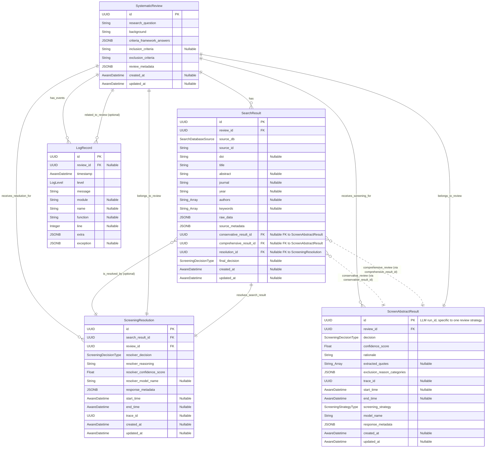

# Data Models and Schemas

This document details the key SQLModel database models and Pydantic schemas used for data validation, API operations, and LLM interactions within the Systematic Review Assistant application.

## Table of Contents

- [Guiding Principles](#guiding-principles)
- [SQLModel Database Models (Overview)](#sqlmodel-database-models-overview)
- [Pydantic Schemas for API Operations and LLM Interactions](#pydantic-schemas-for-api-operations-and-llm-interactions)
  - [Systematic Review Schemas](#systematic-review-schemas)
  - [Search Result Schemas](#search-result-schemas)
  - [Screening Schemas (LLM and Service Layer)](#screening-schemas-llm-and-service-layer)
  - [Suggestion Agent Schemas](#suggestion-agent-schemas)
- [Notes on Existing `src/sr_assistant/core/schemas.py`](#notes-on-existing-srcsr_assistantcoreschemaspy)

## Guiding Principles

- **Clarity and Purpose:** Each schema should have a clear purpose (e.g., creating a resource, updating a resource, reading a resource, LLM input/output).
- **Validation:** Schemas provide a layer of data validation before data enters the service layer or is sent to LLMs.
- **API Contract:** `Create`, `Update`, and `Read` schemas form a critical part of the API contract defined in `docs/api-reference.md`.
- **Immutability for LLM I/O:** Schemas representing direct LLM input or output should be treated as immutable contracts where possible.
- **Inheritance:** All Pydantic schemas defined for this project **MUST** inherit from `core.schemas.BaseSchema` to ensure consistent `model_config` application (e.g., `populate_by_name`, `validate_assignment`, `use_attribute_docstrings`).

#### Pydantic Field Documentation Standard

- **Field Docstrings are Mandatory:** All fields within Pydantic models **MUST** be documented using a field-specific docstring written directly beneath the field definition.
  ```python
  from sr_assistant.core.schemas import BaseSchema
  
  class MySchema(BaseSchema):
      my_field: str
      """This is the official documentation for my_field. It will be shown by IDEs and in JSONSchema."""
  ```
- **AVOID `Field(description=...)`:** The `description` parameter within `pydantic.Field()` **MUST NOT** be used for primary field documentation. While this `description` is included in the JSON schema (useful for OpenAPI docs), it is **NOT** visible in IDE tooltips or via Language Server Protocol (LSP) introspection when working with the Python code. Field docstrings are visible and are the standard for this project.
- **Rationale:** This standard ensures that documentation is accessible to developers directly within their IDEs, improving code comprehensibility and maintainability. The `BaseSchema.model_config` is set with `use_attribute_docstrings=True` to automatically populate the JSON schema `description` from these field docstrings, providing the best of both worlds.

## SQLModel Database Models (Overview)

The source of truth for database table structures is defined using SQLModel in `src/sr_assistant/core/models.py`. Key models include:

- `SystematicReview`: Stores review protocols, research questions, and criteria.
- `SearchResult`: Stores individual records retrieved from academic databases.
- `ScreenAbstractResult`: Stores the outcome of an LLM screening decision (conservative or comprehensive) for a `SearchResult`.
- `ScreeningResolution`: Stores the outcome of the conflict resolution process for a `SearchResult`.
- `LogRecord`: For application logging (details not covered in this document).

Below is an Entity Relationship Diagram illustrating the primary relationships between these core models.



This document will focus on the Pydantic schemas used for interacting with these models via the service layer and with LLMs.

## Pydantic Schemas for API Operations and LLM Interactions

These schemas are, or should be, defined in `src/sr_assistant/core/schemas.py`.

### Systematic Review Schemas

These schemas are used for creating, reading, and updating `SystematicReview` entities. All schemas inherit from `core.schemas.BaseSchema`.

#### `SystematicReviewCreate`

Used by `ReviewService.create_review` for creating new systematic review protocols.

```python
import uuid
from collections.abc import MutableMapping

from pydantic import Field, JsonValue

from sr_assistant.core.schemas import BaseSchema # Assuming BaseSchema is in this path
from sr_assistant.core.types import CriteriaFramework, AwareDatetime # Assuming types are here

class SystematicReviewCreate(BaseSchema):
    background: str | None = None
    """Optional background context for the systematic review."""

    research_question: str
    """The primary research question the systematic review aims to answer. This field is mandatory."""

    criteria_framework: CriteriaFramework | None = None
    """The specific criteria framework being used (e.g., PICO, SPIDER)."""

    criteria_framework_answers: MutableMapping[str, JsonValue] = Field(default_factory=dict)
    """A dictionary holding the answers/components for the chosen criteria_framework (e.g., keys like 'population', 'intervention' for PICO)."""

    inclusion_criteria: str | None = None
    """A string representation of inclusion criteria. 
    IMPORTANT NOTE: Currently, the screening LLM chain uses this field. The `protocol.py` page combines structured `criteria_framework_answers` into this string. This is a known area for future refactoring.
    """

    exclusion_criteria: str
    """A string representation of explicit exclusion criteria. This field is mandatory."""

    review_metadata: MutableMapping[str, JsonValue] = Field(default_factory=dict)
    """Any additional metadata associated with the review, stored as a JSON object."""
```

#### `SystematicReviewUpdate`

Used by `ReviewService.update_review` for partially updating an existing systematic review protocol. All fields are optional.

```python
import uuid
from collections.abc import MutableMapping

from pydantic import Field, JsonValue, AwareDatetime

from sr_assistant.core.schemas import BaseSchema
from sr_assistant.core.types import CriteriaFramework

class SystematicReviewUpdate(BaseSchema):
    background: str | None = None
    """Optional background context for the systematic review."""

    research_question: str | None = None
    """The primary research question the systematic review aims to answer."""

    criteria_framework: CriteriaFramework | None = None
    """The specific criteria framework being used (e.g., PICO, SPIDER)."""

    criteria_framework_answers: MutableMapping[str, JsonValue] | None = None
    """A dictionary holding the answers/components for the chosen criteria_framework."""

    inclusion_criteria: str | None = None
    """A string representation of inclusion criteria."""

    exclusion_criteria: str | None = None
    """A string representation of explicit exclusion criteria."""

    review_metadata: MutableMapping[str, JsonValue] | None = None
    """Any additional metadata associated with the review, stored as a JSON object."""
```

**Note on existing `schemas.py`:** The current `SystematicReviewUpdate` in `schemas.py` inherits from a `SystematicReviewBase` which has non-optional fields, causing linter errors when `SystematicReviewUpdate` tries to make them optional. The definition above, with all fields explicitly optional and typed with `| None = None`, is the correct pattern for an update schema.

#### `SystematicReviewRead`

Schema for returning `SystematicReview` data from the service layer, including database-generated fields.

```python
import uuid
from collections.abc import MutableMapping

from pydantic import Field, JsonValue, AwareDatetime

from sr_assistant.core.schemas import BaseSchema
from sr_assistant.core.types import CriteriaFramework

class SystematicReviewRead(BaseSchema):
    id: uuid.UUID
    """The unique identifier of the systematic review."""

    created_at: AwareDatetime | None = None
    """Timestamp of when the review was created in the database (UTC). Must be timezone-aware."""

    updated_at: AwareDatetime | None = None
    """Timestamp of when the review was last updated in the database (UTC). Must be timezone-aware."""

    background: str | None
    """Background context for the systematic review."""

    research_question: str
    """The primary research question the systematic review aims to answer."""

    criteria_framework: CriteriaFramework | None
    """The specific criteria framework being used (e.g., PICO, SPIDER)."""

    criteria_framework_answers: MutableMapping[str, JsonValue]
    """A dictionary holding the answers/components for the chosen criteria_framework."""

    inclusion_criteria: str | None
    """A string representation of inclusion criteria. 
    IMPORTANT NOTE: (See note in SystematicReviewCreate and API Reference)
    """

    exclusion_criteria: str
    """A string representation of explicit exclusion criteria."""

    review_metadata: MutableMapping[str, JsonValue]
    """Any additional metadata associated with the review, stored as a JSON object."""
```

*(The `SystematicReviewRead` schema in the current `schemas.py` generally aligns with this, but ensure `created_at` and `updated_at` are correctly typed, ideally as `AwareDatetime` from Pydantic or a custom `UtcDatetime` type if defined.)*

### Search Result Schemas

These schemas are primarily for reading and updating `SearchResult` entities. Creation is handled internally by `SearchService` after fetching from external APIs. All schemas inherit from `core.schemas.BaseSchema`.

#### `SearchResultRead`

Schema for returning `SearchResult` data from the service layer.

```python
import uuid
import collections.abc # For Mapping
from pydantic import JsonValue, AwareDatetime

from sr_assistant.core.schemas import BaseSchema
from sr_assistant.core.types import SearchDatabaseSource, ScreeningDecisionType

# Conceptual: Forward references might be needed if these Read schemas are also defined here
# from typing import TYPE_CHECKING
# if TYPE_CHECKING:
#     from .screening_schemas import ScreeningResultRead, ScreeningResolutionRead # Example if they were in a different module

class SearchResultRead(BaseSchema):
    id: uuid.UUID
    """Unique identifier for the search result."""

    review_id: uuid.UUID
    """Identifier of the systematic review this search result belongs to."""

    source_db: SearchDatabaseSource
    """The source database from which this result was obtained (e.g., PubMed, Scopus)."""

    source_id: str
    """The unique identifier of this record within its source database (e.g., PMID)."""

    doi: str | None
    """Digital Object Identifier, if available."""

    title: str
    """The title of the publication."""

    abstract: str | None
    """The abstract of the publication."""

    journal: str | None
    """The name of the journal in which the publication appeared."""

    year: str | None # Aligning with models.py SearchResult.year which is str | None
    """The publication year (as a string)."""

    authors: list[str] | None
    """A list of author names."""

    keywords: list[str] | None
    """A list of keywords associated with the publication."""

    raw_data: collections.abc.Mapping[str, JsonValue]
    """The original raw data record fetched from the source API."""

    source_metadata: collections.abc.Mapping[str, JsonValue]
    """Additional source-specific metadata."""

    created_at: AwareDatetime | None
    """Timestamp of when this search result was first stored (UTC). Must be timezone-aware."""

    updated_at: AwareDatetime | None
    """Timestamp of when this search result was last updated (UTC). Must be timezone-aware."""

    # Fields related to screening and resolution
    final_decision: ScreeningDecisionType | None = None
    """The final screening decision after any conflict resolution. Null if not yet resolved or no conflict."""

    resolution_id: uuid.UUID | None = None
    """Identifier of the ScreeningResolution record, if a conflict was resolved for this search result."""

    # Optional related objects (conceptual, actual loading depends on service/repo query)
    # conservative_result: "ScreeningResultRead" | None = None # Example for self-referential/forward Pydantic models
    # comprehensive_result: "ScreeningResultRead" | None = None
    # resolution: "ScreeningResolutionRead" | None = None
```

**Note on existing `schemas.py`:**
- The current `SearchResultRead` in `schemas.py` has `year: str | None` (which is correct per `models.py`).
- It uses `t.Mapping` which should be `collections.abc.Mapping`.
- It may be missing `final_decision` and `resolution_id`. Add these.

#### `SearchResultUpdate`

Used by `SearchService.update_search_result` for partially updating an existing search result. All fields are optional.

```python
import uuid
import collections.abc # For Mapping
from pydantic import JsonValue

from sr_assistant.core.schemas import BaseSchema
from sr_assistant.core.types import ScreeningDecisionType

class SearchResultUpdate(BaseSchema):
    doi: str | None = None
    """Digital Object Identifier."""

    title: str | None = None
    """The title of the publication."""

    abstract: str | None = None
    """The abstract of the publication."""

    journal: str | None = None
    """The name of the journal."""

    year: str | None = None
    """The publication year (as a string)."""

    authors: list[str] | None = None
    """A list of author names."""

    keywords: list[str] | None = None
    """A list of keywords."""

    raw_data: collections.abc.Mapping[str, JsonValue] | None = None
    """The original raw data record."""

    source_metadata: collections.abc.Mapping[str, JsonValue] | None = None
    """Additional source-specific metadata."""

    # Fields related to screening and resolution that might be updated via SearchService
    final_decision: ScreeningDecisionType | None = None
    """The final screening decision after any conflict resolution."""

    resolution_id: uuid.UUID | None = None
    """Identifier of the ScreeningResolution record."""
```
**Recommendation for `schemas.py`:** Create the `SearchResultUpdate` schema as defined above.

### Screening Schemas (LLM and Service Layer)

These schemas define the data structures for LLM outputs related to screening, and for creating, reading, and updating `ScreenAbstractResult` and `ScreeningResolution` entities via the `ScreeningService`. All Pydantic schemas inherit from `core.schemas.BaseSchema`.

#### `ScreeningResponse` (LLM Output for Reviewers)

This schema defines the structured output expected from the conservative and comprehensive reviewer LLM chains. It is defined in `src/sr_assistant/core/schemas.py`.

```python
from pydantic import Field, JsonValue

from sr_assistant.core.schemas import BaseSchema, ExclusionReasons # Assuming ExclusionReasons is defined
from sr_assistant.core.types import ScreeningDecisionType

class ScreeningResponse(BaseSchema):
    decision: ScreeningDecisionType
    """The screening decision (INCLUDE, EXCLUDE, UNCERTAIN). If confidence is < 0.8, should be UNCERTAIN."""

    confidence_score: float = Field(ge=0.0, le=1.0) # Pydantic v1 ge/le, v2 use GtE/LtE validators
    """The confidence score [0.0, 1.0] for the decision. If < 0.8, decision must be UNCERTAIN."""

    rationale: str
    """Specific rationale for the decision, explaining how abstract content relates to criteria."""

    extracted_quotes: list[str] | None = None
    """Supporting quotes from the title/abstract. Optional, can be omitted if uncertain."""

    exclusion_reason_categories: ExclusionReasons | None = None
    """PRISMA exclusion reason categories. Must be set if decision is EXCLUDE. Omit if INCLUDE."""
```

#### `ScreeningResult` (Hydrated LLM Output)

This schema represents a `ScreeningResponse` that has been processed and hydrated with additional context (like IDs, timestamps) by the `screen_abstracts_chain_on_end_cb` listener. It is defined in `src/sr_assistant/core/schemas.py`.

```python
import uuid
from pydantic import Field, JsonValue, AwareDatetime

from sr_assistant.core.schemas import BaseSchema, ScreeningResponse # Assumes ScreeningResponse is as above
from sr_assistant.core.types import ScreeningStrategyType

class ScreeningResult(ScreeningResponse):
    id: uuid.UUID
    """Screening result ID, typically the LangSmith Run ID of the specific reviewer invocation."""

    review_id: uuid.UUID
    """ID of the SystematicReview this screening pertains to."""

    search_result_id: uuid.UUID
    """ID of the SearchResult being screened."""

    trace_id: uuid.UUID
    """LangSmith trace_id, shared between reviewers for the same SearchResult input."""

    model_name: str
    """Name of the LLM used for this screening decision."""

    screening_strategy: ScreeningStrategyType
    """The strategy used (e.g., CONSERVATIVE, COMPREHENSIVE)."""

    start_time: AwareDatetime
    """UTC timestamp when the LLM chain invocation started."""

    end_time: AwareDatetime
    """UTC timestamp when the LLM chain invocation ended."""

    response_metadata: dict[str, JsonValue] = Field(default_factory=dict)
    """Additional metadata from the LLM invocation (inputs, token usage, etc.)."""
```

#### `ScreeningResultCreate` (Service Input)

Used by `ScreeningService.add_screening_decision` to create a `ScreenAbstractResult` database record. This schema takes all necessary fields from a `ScreeningResult` (which is an enriched `ScreeningResponse`).

```python
import uuid
from pydantic import Field, JsonValue, AwareDatetime

from sr_assistant.core.schemas import BaseSchema, ExclusionReasons
from sr_assistant.core.types import ScreeningDecisionType, ScreeningStrategyType

class ScreeningResultCreate(BaseSchema):
    # Fields from ScreeningResponse / ScreeningResult that are directly stored
    decision: ScreeningDecisionType
    """The screening decision (INCLUDE, EXCLUDE, UNCERTAIN)."""

    confidence_score: float = Field(ge=0.0, le=1.0)
    """The confidence score [0.0, 1.0] for the decision."""

    rationale: str
    """Specific rationale for the decision."""

    extracted_quotes: list[str] | None = None
    """Supporting quotes from the title/abstract."""

    exclusion_reason_categories: ExclusionReasons | None = None # Or dict[str, list[str]] if ExclusionReasons model is complex
    """PRISMA exclusion reason categories as a structured object or dict."""

    # Fields from ScreeningResult (contextual/metadata)
    id: uuid.UUID # This is the LLM run_id, used as PK for ScreenAbstractResult model
    """Screening result ID, from the LangSmith Run ID of the reviewer invocation."""

    review_id: uuid.UUID
    """ID of the SystematicReview this screening pertains to."""

    # search_result_id is implicitly linked when ScreenAbstractResult is created/associated
    # It's not directly part of ScreenAbstractResult model but crucial for relating.
    # The service method add_screening_decision would need search_result_id to link it.
    # However, the ScreenAbstractResult model itself does not have search_result_id.
    # This indicates a potential modeling issue or a need to pass search_result_id separately to the service.
    # For now, assuming the ScreenAbstractResult model will be updated or service handles linking.
    # Let's assume ScreenAbstractResult SQLModel will have a search_result_id FK.

    trace_id: uuid.UUID | None = None # Nullable, as per model
    """LangSmith trace_id, shared between reviewers for the same SearchResult input."""

    model_name: str
    """Name of the LLM used for this screening decision."""

    screening_strategy: ScreeningStrategyType
    """The strategy used (e.g., CONSERVATIVE, COMPREHENSIVE)."""

    start_time: AwareDatetime | None = None # Nullable, as per model
    """UTC timestamp when the LLM chain invocation started. Must be timezone-aware if not None."""

    end_time: AwareDatetime | None = None # Nullable, as per model
    """UTC timestamp when the LLM chain invocation ended. Must be timezone-aware if not None."""

    response_metadata: dict[str, JsonValue] = Field(default_factory=dict)
    """Additional metadata from the LLM invocation (inputs, token usage, etc.)."""
```
**Note on linking `ScreenAbstractResult` to `SearchResult`:**
The `models.SearchResult` (defined in `src/sr_assistant/core/models.py`) already contains `conservative_result_id` and `comprehensive_result_id`. These fields are foreign keys to `ScreenAbstractResult.id`. 
This means a `ScreenAbstractResult` record is created first (using data from this `ScreeningResultCreate` schema).
The `ScreeningService.add_screening_decision` method (defined in `docs/api-reference.md`) is then responsible for:
   1. Taking `search_result_id` and `screening_strategy` as parameters (alongside `ScreeningResultCreate` data).
   2. Creating the `ScreenAbstractResult` record.
   3. Updating the corresponding `SearchResult` record's `conservative_result_id` or `comprehensive_result_id` field with the ID of the newly created `ScreenAbstractResult`.
This `ScreeningResultCreate` schema itself does not need to contain `search_result_id` as that context is passed directly to the service method.

#### `ScreeningResultUpdate` (Service Input)

Used by `ScreeningService.update_screening_decision`. All fields are optional.

```python
import uuid
from pydantic import Field, JsonValue, AwareDatetime

from sr_assistant.core.schemas import BaseSchema, ExclusionReasons
from sr_assistant.core.types import ScreeningDecisionType, ScreeningStrategyType

class ScreeningResultUpdate(BaseSchema):
    decision: ScreeningDecisionType | None = None
    """The screening decision."""

    confidence_score: float | None = Field(default=None, ge=0.0, le=1.0)
    """The confidence score."""

    rationale: str | None = None
    """Specific rationale."""

    extracted_quotes: list[str] | None = None
    """Supporting quotes."""

    exclusion_reason_categories: ExclusionReasons | None = None
    """PRISMA exclusion categories."""

    trace_id: uuid.UUID | None = None
    """LangSmith trace_id."""

    model_name: str | None = None
    """Name of the LLM."""

    screening_strategy: ScreeningStrategyType | None = None
    """The strategy used."""

    start_time: AwareDatetime | None = None
    """Invocation start time. Must be timezone-aware if not None."""

    end_time: AwareDatetime | None = None
    """Invocation end time. Must be timezone-aware if not None."""

    response_metadata: dict[str, JsonValue] | None = None
    """Additional LLM metadata."""
```

#### `ScreeningResultRead` (Service Output)

Schema for returning `ScreenAbstractResult` data from the service layer.

```python
import uuid
from pydantic import Field, JsonValue, AwareDatetime

from sr_assistant.core.schemas import BaseSchema, ExclusionReasons
from sr_assistant.core.types import ScreeningDecisionType, ScreeningStrategyType

class ScreeningResultRead(BaseSchema):
    id: uuid.UUID
    """Unique ID of this screening record (typically the LLM run_id)."""

    created_at: AwareDatetime | None
    """Timestamp of when this record was created in the database (UTC). Must be timezone-aware."""

    updated_at: AwareDatetime | None
    """Timestamp of when this record was last updated (UTC). Must be timezone-aware."""

    decision: ScreeningDecisionType
    """The screening decision."""

    confidence_score: float
    """The confidence score."""

    rationale: str
    """Rationale for the decision."""

    extracted_quotes: list[str] | None
    """Supporting quotes."""

    exclusion_reason_categories: dict[str, list[str]] # Based on model's JSONB storage
    """PRISMA exclusion reason categories."""

    trace_id: uuid.UUID | None
    """LangSmith trace_id."""

    start_time: AwareDatetime | None
    """LLM chain invocation start time. Must be timezone-aware if not None."""

    end_time: AwareDatetime | None
    """LLM chain invocation end time. Must be timezone-aware if not None."""

    screening_strategy: ScreeningStrategyType
    """Screening strategy used."""

    model_name: str
    """LLM model name used."""

    response_metadata: dict[str, JsonValue]
    """Metadata from the LLM invocation."""

    review_id: uuid.UUID
    """ID of the parent SystematicReview."""
    
    # search_result_id would be here if it's part of the ScreenAbstractResult model or joined
```

#### `ScreeningResolutionSchema` (LLM Output for Resolver)

This schema defines the structured output expected from the resolver LLM chain. It is defined in `src/sr_assistant/core/schemas.py`.

```python
import uuid
from pydantic import Field

from sr_assistant.core.schemas import BaseSchema
from sr_assistant.core.types import ScreeningDecisionType

class ScreeningResolutionSchema(BaseSchema):
    resolver_decision: ScreeningDecisionType
    """The final decision made by the resolver (INCLUDE, EXCLUDE, UNCERTAIN)."""

    resolver_reasoning: str
    """Detailed reasoning for the resolver's decision."""

    resolver_confidence_score: float = Field(ge=0.0, le=1.0)
    """Confidence score for the resolver's decision [0.0, 1.0]."""

    resolver_include: list[str] = Field(default_factory=list)
    """DEPRECATED/Legacy: List of original screening strategies the resolver agrees with. 
    This field might be removed or re-evaluated as the primary output is `resolver_decision`.
    """

    # The following fields are NOT expected from the LLM but are part of the existing
    # schema in schemas.py, intended to be populated by the calling code before DB save.
    # For a pure LLM output schema, these would be omitted.
    # For this documentation, we reflect the current schemas.py structure.
    review_id: uuid.UUID | None = None
    """ID of the systematic review. To be populated by the caller (ScreeningService)."""

    search_result_id: uuid.UUID | None = None
    """ID of the search result being resolved. To be populated by the caller (ScreeningService)."""

    conservative_result_id: uuid.UUID | None = None
    """ID of the conservative screening result. To be populated by the caller (ScreeningService)."""

    comprehensive_result_id: uuid.UUID | None = None
    """ID of the comprehensive screening result. To be populated by the caller (ScreeningService)."""
```
**Note:** The `ScreeningResolutionSchema` in `schemas.py` includes several IDs (`review_id`, `search_result_id`, etc.) that are marked as populated by the calling code. For a schema *strictly* representing LLM output, these would be omitted. The `ScreeningService.store_resolution_results` method would take the LLM's output (decision, reasoning, confidence) and combine it with the necessary IDs to create the `models.ScreeningResolution` DB record.

#### `ScreeningResolutionCreate` (Service Input - Conceptual)

This schema represents the data needed by `ScreeningService.store_resolution_results` to create a `ScreeningResolution` DB record. It combines LLM output with necessary context IDs.

```python
import uuid
from pydantic import Field

from sr_assistant.core.schemas import BaseSchema
from sr_assistant.core.types import ScreeningDecisionType

class ScreeningResolutionCreate(BaseSchema):
    search_result_id: uuid.UUID
    """ID of the SearchResult this resolution applies to."""

    review_id: uuid.UUID
    """ID of the SystematicReview."""
    
    # IDs of the original screening results that led to this conflict/resolution
    conservative_result_id: uuid.UUID | None = None # ID of the models.ScreenAbstractResult
    """ID of the conservative screening result, if applicable."""
    
    comprehensive_result_id: uuid.UUID | None = None # ID of the models.ScreenAbstractResult
    """ID of the comprehensive screening result, if applicable."""

    # Data from the resolver LLM (subset of ScreeningResolutionSchema)
    resolver_decision: ScreeningDecisionType
    """The final decision made by the resolver."""

    resolver_reasoning: str
    """Detailed reasoning from the resolver."""

    resolver_confidence_score: float = Field(ge=0.0, le=1.0)
    """Confidence score from the resolver."""

    resolver_model_name: str | None = None # Provided by the system invoking the resolver
    """Name of the LLM used for resolution."""

    response_metadata: dict[str, JsonValue] = Field(default_factory=dict) # From resolver LLM call
    """Metadata from the resolver LLM invocation."""
    
    start_time: AwareDatetime | None = None # From resolver LLM call
    """UTC timestamp of resolver LLM start. Must be timezone-aware if not None."""
    
    end_time: AwareDatetime | None = None # From resolver LLM call
    """UTC timestamp of resolver LLM end. Must be timezone-aware if not None."""
    
    trace_id: uuid.UUID | None = None # From resolver LLM call
    """LangSmith trace_id for the resolver invocation."""
```

#### `ScreeningResolutionRead` (Service Output)

Schema for returning `ScreeningResolution` data from the service layer.

```python
import uuid
from pydantic import Field, JsonValue, AwareDatetime

from sr_assistant.core.schemas import BaseSchema
from sr_assistant.core.types import ScreeningDecisionType

class ScreeningResolutionRead(BaseSchema):
    id: uuid.UUID
    """Unique ID of this screening resolution record."""

    created_at: AwareDatetime | None
    """Timestamp of when this record was created (UTC). Must be timezone-aware."""

    updated_at: AwareDatetime | None
    """Timestamp of when this record was last updated (UTC). Must be timezone-aware."""

    search_result_id: uuid.UUID
    """ID of the SearchResult this resolution applies to."""

    review_id: uuid.UUID
    """ID of the SystematicReview."""

    resolver_decision: ScreeningDecisionType
    """The final decision made by the resolver."""

    resolver_reasoning: str
    """Detailed reasoning from the resolver."""

    resolver_confidence_score: float
    """Confidence score from the resolver."""

    resolver_model_name: str | None
    """Name of the LLM used for resolution."""

    response_metadata: dict[str, JsonValue]
    """Metadata from the resolver LLM invocation."""
    
    start_time: AwareDatetime | None
    """UTC timestamp of resolver LLM start. Must be timezone-aware if not None."""
    
    end_time: AwareDatetime | None
    """UTC timestamp of resolver LLM end. Must be timezone-aware if not None."""
    
    trace_id: uuid.UUID | None
    """LangSmith trace_id for the resolver invocation."""
    
    # Potentially IDs of original conflicting ScreenAbstractResult records if needed
    # conservative_result_id: uuid.UUID | None
    # comprehensive_result_id: uuid.UUID | None
```

### Suggestion Agent Schemas

These schemas are related to the PICO suggestion agent functionality in `protocol.py`. All schemas inherit from `core.schemas.BaseSchema`.

#### `PicosSuggestions` (LLM Output)

Structured PICO suggestions from the LLM, as defined in `src/sr_assistant/core/schemas.py`.

```python
from sr_assistant.core.schemas import BaseSchema

class PicosSuggestions(BaseSchema):
    population: str
    """Suggested Population/Problem description based on context."""

    intervention: str
    """Suggested Intervention/Exposure description."""

    comparison: str
    """Suggested Comparison/Control description."""

    outcome: str
    """Suggested Outcome description."""

    general_critique: str
    """General critique and suggestions for the overall protocol based on the input research question and background."""
```

#### `SuggestionResult` (Agent Output)

A `TypedDict` (defined in `src/sr_assistant/core/schemas.py`) that wraps the output from the suggestion agent.

```python
from typing import TypedDict
# from .picos_suggestions import PicosSuggestions # If PicosSuggestions is in a separate file

class SuggestionResult(TypedDict):
    pico: PicosSuggestions | None
    """The structured PICO suggestions, or None if not applicable/generated."""

    raw_response: str
    """The raw textual response from the LLM, which includes the general critique."""
```

## Notes on Existing `src/sr_assistant/core/schemas.py`

This section summarizes key discrepancies found or recommendations made while documenting the data models and schemas above, relative to the current state of `src/sr_assistant/core/schemas.py`.

- **`SystematicReviewUpdate` Inheritance/Structure:**
  - **Issue:** Current `SystematicReviewUpdate` inherits `SystematicReviewBase` and attempts to make non-optional base fields optional, causing linter errors.
  - **Recommendation:** `SystematicReviewUpdate` should have all its fields explicitly defined as `Optional[<type>] = Field(default=None)`. It may be cleaner for it not to inherit `SystematicReviewBase` if this continues to cause issues, or `SystematicReviewBase` could be refactored such that its fields are `Optional` and `SystematicReviewCreate` enforces non-optionality where needed.

- **`SearchResultRead.year` Type:**
  - **Current:** `str | None` (This is correct as per `models.SearchResult.year`).
  - **Note:** The `SearchService._map_pubmed_to_search_result` method (in `services.py`) had a linter warning implying it might try to pass an `int`. The service/mapping logic must ensure it provides a `str` to align with the model and this schema.

- **`t.Mapping` vs. `collections.abc.Mapping`:**
  - **Issue:** `SearchResultRead` in `schemas.py` uses `t.Mapping` for `raw_data` and `source_metadata`.
  - **Recommendation:** Replace `typing.Mapping` with `collections.abc.Mapping` as `typing.Mapping` is deprecated since Python 3.9.

- **Missing `Update` Schemas:**
  - `SearchResultUpdate` is not currently defined in `schemas.py` but is required by the `SearchService` API.
  - `ScreeningResultUpdate` is not currently defined but is good practice for the `ScreeningService` API.

- **Missing `Create` Schemas (for Service Layer):**
  - `ScreeningResultCreate` is not currently defined but is the recommended input schema for `ScreeningService.add_screening_decision`.
  - A `ScreeningResolutionCreate` (or similar) would be beneficial for `ScreeningService.store_resolution_results` to clearly define the data contract for creating a `ScreeningResolution` model, separate from the direct LLM output (`ScreeningResolutionSchema`).

- **`ScreeningResolutionSchema` Fields:**
  - **Issue:** The current `ScreeningResolutionSchema` in `schemas.py` includes fields (`review_id`, `search_result_id`, `conservative_result_id`, `comprehensive_result_id`) that are intended to be populated by the calling code (service layer) rather than being output by the LLM itself.
  - **Recommendation:** For clarity, the schema representing *direct LLM output* for the resolver should ideally only contain `resolver_decision`, `resolver_reasoning`, `resolver_confidence_score` (and potentially the legacy `resolver_include`). The service layer would then combine this with the necessary IDs to construct the `ScreeningResolutionCreate` data for database persistence. This distinction should be made clear if `ScreeningResolutionSchema` is refactored.
  - **Naming Convention Note:** As per `docs/naming-conventions.md`, for consistency with `ScreeningResponse`, `ScreeningResolutionSchema` should ideally be refactored to `ScreeningResolutionResponse` in the future.

- **`ScreenAbstractResult` SQLModel `search_result_id`:**
  - **Requirement:** The `ScreenAbstractResult` SQLModel in `models.py` needs a foreign key to `SearchResult` (e.g., `search_result_id: uuid.UUID = Field(foreign_key="search_results.id")`) to properly link screening decisions to the items they screen. This is essential for the `ScreeningResultCreate` schema to function as intended with the service layer.

- **Pydantic Field Documentation:**
  - **Standard:** Ensure all Pydantic models in `schemas.py` follow the project standard of using field docstrings (`"""Docstring"""`) for documentation and avoid using the `description` parameter in `Field()`, ensuring `BaseSchema` is the parent for all.

- **Linter Errors in `schemas.py`:** Address the identified linter errors, particularly the type override issues in `SystematicReviewUpdate` and the deprecated `t.Mapping`.

| Change          | Date       | Version | Description             | Author          |
|-----------------|------------|---------|-------------------------|-----------------|
| Initial Draft   | 2025-05-12 | 0.1     | Initial structure and SystematicReview schemas. | Architect Agent |
| SearchResult Schemas | 2025-05-12 | 0.2     | Added SearchResultRead and SearchResultUpdate schemas. | Architect Agent |
| Screening Schemas | 2025-05-12 | 0.3     | Added all Screening-related schemas (Response, Result, Create, Update, Read, ResolutionSchema, ResolutionCreate, ResolutionRead). | Architect Agent |
| Suggestion Schemas & Notes | 2025-05-12 | 0.4     | Added Suggestion Agent schemas and comprehensive "Notes on Existing schemas.py". | Architect Agent |
| AwareDatetime Fix & Principles | 2025-05-12 | 0.5     | Corrected AwareDatetime imports. Added Pydantic Field Docstring Standard to Guiding Principles. | Architect Agent |
| ERD and Patterns | 2025-05-12 | 0.6     | Added Mermaid ERD for core SQLModels. (Pattern discussion moved to architecture.md) | Architect Agent |
| ERD Fixes        | 2025-05-12 | 0.6.1   | Corrected Mermaid ERD syntax (comments, relationship naming). | Architect Agent |
| ERD Completeness | 2025-05-12 | 0.6.2   | Added more fields to entities in ERD and included LogRecord model. | Architect Agent |
| Naming Convention Note | 2025-05-12 | 0.7     | Added note regarding future renaming of `ScreeningResolutionSchema`. | Architect Agent |