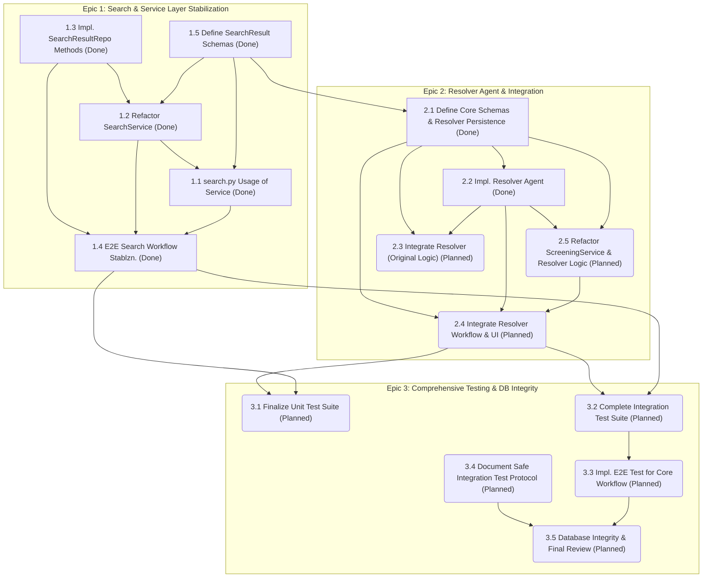

# Story Dependency Diagram

This diagram outlines the dependencies between user stories across different epics.

## Diagram Key

- `[Story ID "Description (Done)"]`: Represents a completed story (rectangle shape).
- `(Story ID "Description (Planned)")`: Represents a planned story (rounded rectangle shape).
- Arrows (`-->`) indicate a direct dependency where the preceding story is a prerequisite.
